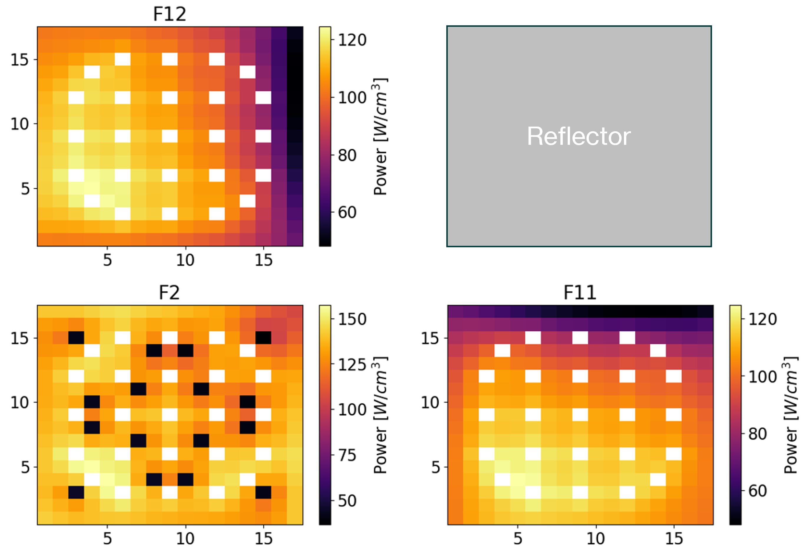

# NRE7203 Documentation

This repository documents all projects completed in NRE7203 Advanced Reactor Physics at Georgia Tech with Dr. Dan Kotlyar.
Documentation is converted from `reStructuredText` files to an `html` format using Sphinx.
The source `rst` files are viewable within the "documentation" folder.
The website documenting projects can be viewed using the following link. https://blankenshipj15.github.io/NRE7203/

# Projects Completed

The class builds from group constant generation all the way to pin-power reconstruction, culminating in some pretty cool results such as:

Documentation is developed more in the form of project reporting than code documentation. However, sample `jupyter notebooks` are provided to show the computations performed. The `python` files containing the classes and functions are not included here to maintain the integrity of future NRE7203 classes.