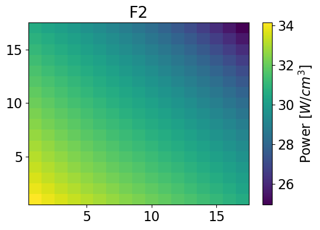

:orphan:

.. _AFENnotebook:

AFEN Method
===========

Return to :ref:`proj5` documentation.

.. code:: python

    from IPython.display import Image
    import matplotlib.pyplot as plt
    from matplotlib import rcParams
    import numpy as np
    import time
    # Default values
    FONT_SIZE = 16  # font size for plotting purposes
    # rcParams['figure.dpi'] = 300
    plt.rcParams['figure.figsize'] = [6, 4] # Set default figure size

.. code:: python

    from analytic_nodal_expansion import AFEN2D, meshPlot, GetSerpentRes
    from NEM import CartesianNem1D, Plot1d
    import serpentTools

Flux and pin-power reconstruction
=================================

Colorset 2-dim test case
------------------------

.. code:: python

    imgFile = './serpent/SMR/SMR_Ref_2D_2g_geom1.png'
    resFile = './serpent/SMR/SMR_Ref_2D_2g_res.m'
    detFile = './serpent/SMR/SMR_Ref_2D_2g_det0.m'

.. code:: python

    Image(imgFile,  width=400, height=300)

**Universes** within the colorset: - Upper left **F12** - 2.6%
:math:`UO_2` - Upper right **Ref** - stainless steel (with water for
PWR) - Bottom left **F2** - 4.55% :math:`UO_2` with 8% :math:`Gd_2`
:math:`O_3` - Bottom right **F11** - 2.6% :math:`UO_2`

Read detector and results data from Serpent
^^^^^^^^^^^^^^^^^^^^^^^^^^^^^^^^^^^^^^^^^^^

.. code:: python

    det = serpentTools.read(detFile) 

.. code:: python

    xsF2, bcF2 = GetSerpentRes(resFile, 'F2', 0)
    xsF11, bcF11 = GetSerpentRes(resFile, 'F11', 0)
    xsF12, bcF12 = GetSerpentRes(resFile, 'F12', 0)
    xsRef, bcRef = GetSerpentRes(resFile, 'Ref', 0)

.. parsed-literal::

    SERPENT Serpent 2.2.1 found in ./serpent/SMR/SMR_Ref_2D_2g_res.m, but version 2.1.31 is defined in settings
      Attempting to read anyway. Please report strange behaviors/failures to developers.
    SERPENT Serpent 2.2.1 found in ./serpent/SMR/SMR_Ref_2D_2g_res.m, but version 2.1.31 is defined in settings
      Attempting to read anyway. Please report strange behaviors/failures to developers.
    SERPENT Serpent 2.2.1 found in ./serpent/SMR/SMR_Ref_2D_2g_res.m, but version 2.1.31 is defined in settings
      Attempting to read anyway. Please report strange behaviors/failures to developers.
    SERPENT Serpent 2.2.1 found in ./serpent/SMR/SMR_Ref_2D_2g_res.m, but version 2.1.31 is defined in settings
      Attempting to read anyway. Please report strange behaviors/failures to developers.
    

Store cross sections and bc in dicts
^^^^^^^^^^^^^^^^^^^^^^^^^^^^^^^^^^^^

.. code:: python

    bc = {'F2': bcF2, 'F11': bcF11, 'F12': bcF12, 'Ref': bcRef,}
    xs = {'F2': xsF2, 'F11': xsF11, 'F12': xsF12, 'Ref': xsRef,}

.. code:: python

    dx, dy = 21.42, 21.42  # cm  - assembly length
    npins = 17

Manipulate the data provided by Serpent (BC)
~~~~~~~~~~~~~~~~~~~~~~~~~~~~~~~~~~~~~~~~~~~~

Serpent already provodes the het flux values for all the surfaces and
corners for each universe.

.. code:: python

    bcflux = {}
    for univ in bc: # defining BC for each universe
        bcflux[univ] = {}
        # store the surface and corner fluxes
        bcflux[univ]['av'] = bc[univ]['flux']
    
        bcflux[univ]['w'] = bc[univ]['wFlux']
        bcflux[univ]['e'] = bc[univ]['eFlux']
        bcflux[univ]['s'] = bc[univ]['sFlux']
        bcflux[univ]['n'] = bc[univ]['nFlux']
        
        # bcflux[univ]['nw'] = bc[univ]['nwFlux']
        # bcflux[univ]['ne'] = bc[univ]['neFlux']
        # bcflux[univ]['sw'] = bc[univ]['swFlux']
        # bcflux[univ]['se'] = bc[univ]['seFlux']
        
        bcflux[univ]['nw'] = bcflux[univ]['n']+bcflux[univ]['w']-bcflux[univ]['av']
        bcflux[univ]['ne'] = bcflux[univ]['n']+bcflux[univ]['e']-bcflux[univ]['av']
        bcflux[univ]['sw'] = bcflux[univ]['s']+bcflux[univ]['w']-bcflux[univ]['av']
        bcflux[univ]['se'] = bcflux[univ]['s']+bcflux[univ]['e']-bcflux[univ]['av']

Manually average the corner fluxes using adjacent fuel assemblies
^^^^^^^^^^^^^^^^^^^^^^^^^^^^^^^^^^^^^^^^^^^^^^^^^^^^^^^^^^^^^^^^^

.. code:: python

    bcflux['F12']['ne'] = (bcflux['F12']['ne'] + bcflux['Ref']['nw'])/2
    bcflux['Ref']['nw'] = bcflux['F12']['ne'] 
    
    bcflux['F12']['sw'] = (bcflux['F12']['sw'] + bcflux['F2']['nw'])/2
    bcflux['F2']['nw'] = bcflux['F12']['sw']
    
    bcflux['F2']['se'] = (bcflux['F2']['se'] + bcflux['F11']['sw'])/2 
    bcflux['F11']['sw'] = bcflux['F2']['se'] 
    
    bcflux['F11']['ne'] = (bcflux['F11']['ne'] + bcflux['Ref']['se'])/2
    bcflux['Ref']['se'] = bcflux['F11']['ne']
    
    bcflux['F12']['se'] = (bcflux['F12']['se'] + bcflux['Ref']['sw']+
                           bcflux['F2']['ne'] + bcflux['F11']['nw'])/4
    bcflux['Ref']['sw'] = bcflux['F12']['se']
    bcflux['F2']['ne'] = bcflux['F12']['se'] 
    bcflux['F11']['nw'] = bcflux['F12']['se'] 

Reconstruct the homogeneous flux
^^^^^^^^^^^^^^^^^^^^^^^^^^^^^^^^

.. code:: python

    univId = 'F2'  # user needs to choose

.. code:: python

    timeStart = time.perf_counter()
    univres = AFEN2D(xs[univId], bcflux[univId], dx, symbolic=False)
    univres.ReconstructFlux()  # a built-in method to obtain the coeffs
    timeEnd = time.perf_counter()
    print('Reconstructed flux for {} calculated in {} seconds'.format(univId,timeEnd-timeStart))

.. parsed-literal::

    Reconstructed flux for F2 calculated in 0.001218500008690171 seconds
    

.. code:: python

    yvals = np.linspace(-dx/2, +dx/2, npins+1)
    yvals = 0.5*(yvals[1:]+yvals[0:-1])
    
    timeStart1 = time.perf_counter()
    univres.GetFlux2D(yvals, yvals)
    timeEnd1 = time.perf_counter()
    print('2D neutron flux for {} calculated in {} seconds'.format(univId,timeEnd1-timeStart1))

.. parsed-literal::

    2D neutron flux for F2 calculated in 0.005599600001005456 seconds
    

Reference flux from Serpent
^^^^^^^^^^^^^^^^^^^^^^^^^^^

.. code:: python

    if univId == 'F2':
        fastHetFlux = det.detectors['flux_fast'].tallies[0:npins, 0:npins]
        thermalHetFlux = det.detectors['flux_thermal'].tallies[0:npins, 0:npins]
        fastPower = det.detectors['power_fast'].tallies[0:npins, 0:npins]
        thermalPower = det.detectors['power_thermal'].tallies[0:npins, 0:npins]
    elif univId == 'F11':
        fastHetFlux = det.detectors['flux_fast'].tallies[0:npins, npins:]
        thermalHetFlux = det.detectors['flux_thermal'].tallies[0:npins, npins:]
        fastPower = det.detectors['power_fast'].tallies[0:npins, npins:]
        thermalPower = det.detectors['power_thermal'].tallies[0:npins, npins:]
    elif univId == 'F12':
        fastHetFlux = det.detectors['flux_fast'].tallies[npins:, 0:npins]
        thermalHetFlux = det.detectors['flux_thermal'].tallies[npins:, 0:npins]
        fastPower = det.detectors['power_fast'].tallies[npins:, 0:npins]
        thermalPower = det.detectors['power_thermal'].tallies[npins:, 0:npins]
    elif univId == 'Ref':
        fastHetFlux = det.detectors['flux_fast'].tallies[npins:, npins:]
        thermalHetFlux = det.detectors['flux_thermal'].tallies[npins:, npins:]
        fastPower = det.detectors['power_fast'].tallies[npins:, npins:]
        thermalPower = det.detectors['power_thermal'].tallies[npins:, npins:]

Plot results
^^^^^^^^^^^^

1. **Fast** flux distribution
2. **Thermal** flux distribution

Fast Flux 2-dim
^^^^^^^^^^^^^^^

.. code:: python

    meshPlot(fastHetFlux, 17, univId, 'flux')
    meshPlot(univres.flux2d[0], 17, univId, 'flux')

.. image:: AFENMethod_files/AFENMethod_27_1.png

Thermal Flux 2-dim
^^^^^^^^^^^^^^^^^^

.. code:: python

    meshPlot(thermalHetFlux, 17, univId, 'flux')
    meshPlot(univres.flux2d[1], 17, univId, 'flux')

.. image:: AFENMethod_files/AFENMethod_29_0.png

.. image:: AFENMethod_files/AFENMethod_29_1.png

Fast Power 2-dim
^^^^^^^^^^^^^^^^

.. code:: python

    meshPlot(fastPower, 17, univId, 'power')
    fastPowerHom = univres.HomogeneousPower(univres.flux2d, npins)[0]
    meshPlot(fastPowerHom, 17, univId, 'power')

Thermal Power 2-dim
~~~~~~~~~~~~~~~~~~~

.. code:: python

    meshPlot(thermalPower, 17, univId, 'power')
    thermalPowerHom = univres.HomogeneousPower(univres.flux2d, npins)[1]
    meshPlot(thermalPowerHom, 17, univId, 'power')

.. image:: AFENMethod_files/AFENMethod_33_1.png

Total Power Plots
~~~~~~~~~~~~~~~~~

.. code:: python

    serpentPower = fastPower + thermalPower
    totalPower = univres.HomogeneousPower(univres.flux2d, npins, total=True)
    meshPlot(serpentPower, 17, univId, 'power')
    meshPlot(totalPower, 17, univId, 'power')

.. image:: AFENMethod_files/AFENMethod_35_0.png

Error for homogenized power distributions
~~~~~~~~~~~~~~~~~~~~~~~~~~~~~~~~~~~~~~~~~

.. code:: python

    # mask = fastPower != 0
    # fastPower[fastPower == 0] = np.nan
    # relativeError = np.abs(fastPower - fastPowerHom) / fastPower
    # # Mask invalid entries with -inf so they’re ignored in max
    # maskedError = np.where(mask, relativeError, -np.inf)
    # maxRelativeError = np.max(maskedError) * 100
    # avRelativeError = np.mean(relativeError[~np.isnan(relativeError)]) * 100
    # maxIdx = np.unravel_index(np.argmax(maskedError), maskedError.shape)
    # row, col = int(maxIdx[0]), int(maxIdx[1])
    # print(f"Max relative error in fast power: {maxRelativeError:.3f}% at index ({row}, {col}) with an average relative error of: {avRelativeError:.3f}%")
    

.. code:: python

    # mask = thermalPower != 0
    # thermalPower[thermalPower == 0] = np.nan
    # relativeError = np.abs(thermalPower - thermalPowerHom) / thermalPower
    # # Mask invalid entries with -inf so they’re ignored in max
    # maskedError = np.where(mask, relativeError, -np.inf)
    # maxRelativeError = np.max(maskedError) * 100
    # avRelativeError = np.mean(relativeError[~np.isnan(relativeError)]) * 100
    # maxIdx = np.unravel_index(np.argmax(maskedError), maskedError.shape)
    # row, col = int(maxIdx[0]), int(maxIdx[1])
    # print(f"Max relative error in thermal power: {maxRelativeError:.3f}% at index ({row}, {col}) with an average relative error of: {avRelativeError:.3f}%")

Plot x-dependent y-averaged results for AFEN and NEM
^^^^^^^^^^^^^^^^^^^^^^^^^^^^^^^^^^^^^^^^^^^^^^^^^^^^

.. code:: python

    thermalPowerHomX2 = thermalPowerHom.mean(axis=0)
    # solve for second region using AFEN Method
    univId = 'F11'
    tally = det.detectors['flux_fast'].x[:, 1]
    fastHetFlux = det.detectors['flux_fast'].tallies[npins:, :]
    thermalHetFlux = det.detectors['flux_thermal'].tallies[npins:, :]
    fastPower = det.detectors['power_fast'].tallies[npins:, :]
    thermalPower = det.detectors['power_thermal'].tallies[0:npins]
    univres = AFEN2D(xs[univId], bcflux[univId], dx, symbolic=False)
    univres.ReconstructFlux()  # a built-in method to obtain the coeffs
    univres.GetFlux2D(yvals, yvals)
    
    thermalPowerHomX11 = univres.HomogeneousPower(univres.flux2d, npins)[1].mean(axis=0)

.. code:: python

    # build out NEM solutions for two regions
    fastHetFluxNEM = det.detectors['flux_fast'].tallies[npins:].mean(axis=0)
    thermalHetFluxNEM = det.detectors['flux_thermal'].tallies[npins:].mean(axis=0)
    universesNEM = ['F2', 'F11']
    xs1, bc1 = GetSerpentRes(resFile, universesNEM[0], timeDays=0)
    xs2, bc2 = GetSerpentRes(resFile, universesNEM[1], timeDays=0)
    
    # Left assembly solution
    trLeakage1 = {}
    trLeakage1['eL'] = bc2['nJnet'] - bc2['sJnet']
    trLeakage1['eD'] = xs2['diff']
    trLeakage1['edx'] = dx
    trLeakage1['wL'] = bc1['nJnet'] - bc1['sJnet']
    trLeakage1['wD'] = xs1['diff']
    trLeakage1['wdx'] = dx
    nem1 = CartesianNem1D(dx, dy, xs1, bc1, trLeakage1, symbolic=False)
    nem1.TransverseLeakageCoef('x')  # obtain the coefficients of the TL
    nem1.GetExpansionCoeffs('x', 'diff')
    xvals = np.linspace(-dx/2, +dx/2, npins+1)
    xvals = 0.5*(xvals[1:]+xvals[0:-1])
    flux1 = nem1.GetHomogFlux(xvals)
    
    # Right assembly solution
    trLeakage2 = {}
    trLeakage2['wL'] = bc1['nJnet'] - bc1['sJnet']
    trLeakage2['wD'] = xs1['diff']
    trLeakage2['wdx'] = dx
    trLeakage2['eL'] = bc2['nJnet'] - bc2['sJnet']
    trLeakage2['eD'] = xs2['diff']
    trLeakage2['edx'] = dx
    nem2 = CartesianNem1D(dx, dy, xs2, bc2, trLeakage2, symbolic=False)
    nem2.TransverseLeakageCoef('x')  # obtain the coefficients of the TL
    nem2.GetExpansionCoeffs('x', 'diff')
    flux2 = nem2.GetHomogFlux(xvals)

.. parsed-literal::

    SERPENT Serpent 2.2.1 found in ./serpent/SMR/SMR_Ref_2D_2g_res.m, but version 2.1.31 is defined in settings
      Attempting to read anyway. Please report strange behaviors/failures to developers.
    SERPENT Serpent 2.2.1 found in ./serpent/SMR/SMR_Ref_2D_2g_res.m, but version 2.1.31 is defined in settings
      Attempting to read anyway. Please report strange behaviors/failures to developers.
    

.. code:: python

    # Plot all methods for comparison
    xvals = np.linspace(-dx/2, +dx/2, npins)
    plt.figure()
    Plot1d(tally, thermalPower.mean(axis=0), xlabel="position, cm", 
           ylabel='',
           fontsize=16, marker="-*k", markersize=6, linewidth=2, label="Serpent")
    Plot1d(xvals-10.71, thermalPowerHomX2, xlabel="position, cm", 
           ylabel='Fast Flux',
           fontsize=16, marker="-r", markersize=6, linewidth=2, label="AFEN")
    Plot1d(xvals+10.71, thermalPowerHomX11, xlabel="position, cm", 
           ylabel='Fast Flux',
           fontsize=16, marker="-r", markersize=6, linewidth=2, label="_nolegend_")
    Plot1d(xvals-10.71, xs1['kappa'][1]*1.60218e-13*xs1['fiss'][1]*flux1[1,:], xlabel="position, cm", 
           ylabel=None,
           fontsize=16, marker="-b", markersize=6, linewidth=2, label='NEM')
    Plot1d(xvals+10.71, xs2['kappa'][1]*1.60218e-13*xs2['fiss'][1]*flux2[1,:], xlabel="position, cm", 
           ylabel='Thermal Power',
           fontsize=16, marker="-b", markersize=6, linewidth=2, label="_nolegend_")
    plt.legend()
    plt.grid(visible=True)

