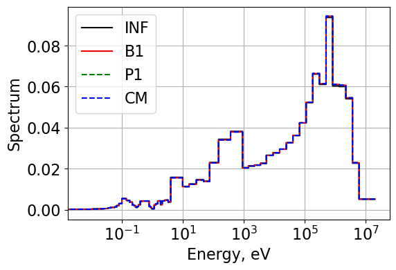

:orphan:

.. _FA_critspectrum:

Critical Spectrum Calculations
==============================

Return to :ref:`proj3` documentation.

.. code:: python

    import matplotlib.pyplot as plt
    from matplotlib import rcParams
    # Default values
    FONT_SIZE = 16  # font size for plotting purposes
    # rcParams['figure.dpi'] = 300
    plt.rcParams['figure.figsize'] = [6, 4] # Set default figure size

.. code:: python

    import numpy as np
    import serpentTools
    from scipy.linalg import solve
    from plotter import Plot1d
    from critical_spectrum import SolveB1, SolveCM, CriticalSpectrum, Condense2gr

The :math:`B_1` Critical spectrum
~~~~~~~~~~~~~~~~~~~~~~~~~~~~~~~~~

.. math::

    \begin{equation}
    \begin{split}
    \Sigma_{t,g}\phi_g-{\sum}_{g'}\Sigma_{s0,g'g}\phi_{g'}\pm iBJ_g=\chi_g \\
    3a_g(B)\Sigma_{t,g}J_g-3{\sum}_{g'}\Sigma_{s1,g'g}J_{g'}=\mp iB\phi_g
    \end{split}
    \end{equation}

Read results from Serpent
~~~~~~~~~~~~~~~~~~~~~~~~~

.. code:: python

    resFile70gr = "./serpent/fa2D_70gr_inf_res.m"
    resFile2gr = "./serpent/fa2D_2gr_B1_res.m"

Two-group results [reference point]
~~~~~~~~~~~~~~~~~~~~~~~~~~~~~~~~~~~

.. code:: python

    res2gr = serpentTools.read(resFile2gr)  
    univ = res2gr.getUniv('0', timeDays=0)
    b1Transp_2gr = univ.b1Exp['b1Transpxs']
    b1Rabsxs_2gr = univ.b1Exp['b1Rabsxs']
    infTransp_2gr = univ.infExp['infTranspxs']
    infRabsxs_2gr = univ.infExp['infRabsxs']  
    infDiff_2gr = 1/(3*infTransp_2gr)
    b1Diff_2gr = 1/(3*b1Transp_2gr)

.. parsed-literal::

    SERPENT Serpent 2.2.1 found in ./serpent/fa2D_2gr_B1_res.m, but version 2.1.31 is defined in settings
      Attempting to read anyway. Please report strange behaviors/failures to developers.
    

70-group results
~~~~~~~~~~~~~~~~

.. code:: python

    # Read the results using the serpentTools package 
    res70gr = serpentTools.read(resFile70gr)

.. parsed-literal::

    SERPENT Serpent 2.2.1 found in ./serpent/fa2D_70gr_inf_res.m, but version 2.1.31 is defined in settings
      Attempting to read anyway. Please report strange behaviors/failures to developers.
    

.. code:: python

    ng = 70  # number of energy groups
    univ0 = res70gr.getUniv('0', timeDays=0)
    flx = univ0.infExp['infFlx']
    sigT = univ0.infExp['infTot']
    rabsxs = univ0.infExp['infRabsxs']
    nusigF = univ0.infExp['infNsf']
    chi = univ0.infExp['infChit']
    SP1 = univ0.infExp['infSp1']
    SP0 = univ0.infExp['infSp0']
    cmmTransp = univ0.gc['cmmTranspxs']  # represents in-scatter
    infTransp = univ0.infExp['infTranspxs']  # out-scatter
    energy = univ0.groups * 1E+06
    kinf = res70gr.resdata['absKeff'][0]  # k-inf

**To create the scattering matrix with the following structure**: 1->1,
2->1 3->1 … 1->2, 2->2 3->2 … 1->3, 2->3 3->3 … …

.. code:: python

    SP1=SP1.reshape((ng,ng)).transpose()
    SP0=SP0.reshape((ng,ng)).transpose()

Solving :math:`B_1` equations with a known :math:`\alpha_g` and :math:`B^2`
~~~~~~~~~~~~~~~~~~~~~~~~~~~~~~~~~~~~~~~~~~~~~~~~~~~~~~~~~~~~~~~~~~~~~~~~~~~

From the second :math:`B_1` equation a relation between :math:`J` and
:math:`\phi` is established.

:math:`\pm iB \vec{J} = B^2 \mathbf{D} \vec{\phi}`

Components of the inverse of **D** are:

:math:`D_{gg'}^{-1}=3\alpha_g\Sigma_{t,g}\delta_{gg'}-3\Sigma_{s1,g'g}`

:math:`\vec{\phi} = \mathbf{A}^{-1}~\vec{\chi}`

where, the components of matrix :math:`A` are:

:math:`A_{gg'}=\Sigma_{t,g}\delta_{gg'}-\Sigma_{s0,g'g}+B^2D_{gg'}`

Solve :math:`B_1`
~~~~~~~~~~~~~~~~~

Methodology to iterate on :math:`B_1`
~~~~~~~~~~~~~~~~~~~~~~~~~~~~~~~~~~~~~

-  :math:`B^2`\ =0 is used to obtain the infinite-medium
   :math:`k_{\infty}` and its associated spectrum. Serpent provide
   :math:`k_{\infty}`.
-  A perturbed value :math:`B^2=0.0001` is used to solve for the flux
   and current.

.. math::

    \begin{equation}
    \begin{split}
    \frac{k_{\infty}}{M^2}=\frac{B^2(k_1)}{\frac{1}{k_1}-\frac{1}{k_{\infty}}}
    \end{split}
    \end{equation}

.. math::

    \begin{equation}
    \begin{split}
    B_1^2(k=1)=B^2(k_1)+\frac{k_{\infty}}{M^2}(\underbrace{1}_{k_{eff}=1}-\frac{1}{k_1})
    \end{split}
    \end{equation}

The coefficient :math:`\frac{k_{\infty}}{M^2}` is evaluated only once.

.. math::

    \begin{equation}
    \begin{split}
    D_g=\frac{\pm iJ_g}{B_1\phi_g}  
    \end{split}
    \end{equation}

Energy condensation
~~~~~~~~~~~~~~~~~~~

.. math::

    \begin{equation}
    \begin{split}
    D_G=\frac{\sum_{g \in G}D_g\phi_g}{\sum_{g \in G}\phi_g}
    \end{split}
    \end{equation}

.. math::

    \begin{equation}
    \begin{split}
    \Sigma_G=\frac{\sum_{g \in G}\Sigma_g\phi_g}{\sum_{g \in G}\phi_g}
    \end{split}
    \end{equation}

Execute the entire sequence
---------------------------

.. code:: python

    crit_flxB1, crit_iJB1, B2B1, iB1 = CriticalSpectrum(ng, SP0, SP1, sigT, cmmTransp, chi, nusigF, kinf, P1=False, CM=False)
    crit_flxP1, crit_iJP1, B2P1, iP1 = CriticalSpectrum(ng, SP0, SP1, sigT, cmmTransp, chi, nusigF, kinf, P1=True, CM=False)
    crit_flxCM, B2CM, iCM= CriticalSpectrum(ng, SP0, SP1, sigT, cmmTransp, chi, nusigF, kinf, P1=False, CM=True)
    
    print(f"The critical B^2 values are B1:{B2B1:.6f}, P1:{B2P1:.6f}, CM:{B2CM:.6f}.")
    print(f"k_inf = 1 +/- 1e-6 was achieved in B1:{iB1} iterations, P1:{iP1} iterations, and CM:{iCM} iterations.")

.. parsed-literal::

    The critical B^2 values are B1:0.000255, P1:0.000254, CM:0.000246.
    k_inf = 1 +/- 1e-6 was achieved in B1:4 iterations, P1:3 iterations, and CM:3 iterations.
    

.. code:: python

    normFlx = flx / flx.sum()
    normFlxCM = crit_flxCM / crit_flxCM.sum()
    normFlxB1 = crit_flxB1 / crit_flxB1.sum()
    normFlxP1 = crit_flxP1 / crit_flxP1.sum()
    flx_diff = 100*(1-normFlx/normFlxB1)

**Compare the flux and current spectrum**

.. code:: python

    plt.figure()
    plt.grid(visible=True)
    Plot1d(energy, normFlx, xlabel="Energy, eV", ylabel='',
            fontsize=16, marker="-k", markerfill=False, markersize=4)
    Plot1d(energy, normFlxB1, xlabel="Energy, eV", ylabel='Spectrum',
            fontsize=16, marker="-r", markerfill=False, markersize=6)
    Plot1d(energy, normFlxP1, xlabel="Energy, eV", ylabel='Spectrum',
            fontsize=16, marker="--g", markerfill=False, markersize=6)
    Plot1d(energy, normFlxCM, xlabel="Energy, eV", ylabel='Spectrum',
            fontsize=16, marker="--b", markerfill=False, markersize=4)
    plt.legend(['INF', 'B1',"P1",'CM'])

.. parsed-literal::

    <matplotlib.legend.Legend at 0x215bd737190>

Diffusion coefficients
~~~~~~~~~~~~~~~~~~~~~~

.. code:: python

    # Use eq. 8.21 to obtain the diffusion coefficient
    DgB1 = (crit_iJB1) / (crit_flxB1 * B2B1**0.5)
    DgP1 = (crit_iJP1) / (crit_flxP1 * B2P1**0.5)
    
    # Note that the diffusion coefficients used in the CM method are calculated using cmmTransport cross sections from Serpent output

Condense into 2-group
~~~~~~~~~~~~~~~~~~~~~

.. math::

    \begin{equation}
    \begin{split}
    D_G=\frac{\sum_{g \in G}D_g\phi_g}{\sum_{g \in G}\phi_g}
    \end{split}
    \end{equation}

.. code:: python

    pred_b1Rabsxs_2gr = Condense2gr(rabsxs, crit_flxB1, energy, cutoffE=0.625)
    pred_b1Diff_2gr = Condense2gr(DgB1, crit_flxB1, energy, cutoffE=0.625)
    pred_p1Rabsxs_2gr = Condense2gr(rabsxs, crit_flxP1, energy, cutoffE=0.625)
    pred_p1Diff_2gr = Condense2gr(DgP1, crit_flxP1, energy, cutoffE=0.625)
    pred_cmRabsxs_2gr = Condense2gr(rabsxs, crit_flxCM, energy, cutoffE=0.625)
    pred_cmDiff_2gr = Condense2gr(1/(3*cmmTransp), crit_flxCM, energy, cutoffE=0.625)
    print(f"B1 (Serpent, Reference) results, Dg: {b1Diff_2gr}, Rabsxs: {b1Rabsxs_2gr}.")
    print(f"B1 2-group results, Dg: {pred_b1Diff_2gr}, Rabsxs: {pred_b1Rabsxs_2gr}.")
    print(f"P1 2-group results, Dg: {pred_p1Diff_2gr}, Rabsxs: {pred_p1Rabsxs_2gr}.")
    print(f"CM 2-group results, Dg: {pred_cmDiff_2gr}, Rabsxs: {pred_cmRabsxs_2gr}.")

.. parsed-literal::

    B1 (Serpent, Reference) results, Dg: [1.69958768 0.88299987], Rabsxs: [0.00775962 0.0676255 ].
    B1 2-group results, Dg: [1.69905265 0.88293977], Rabsxs: [0.00776182 0.06764274].
    P1 2-group results, Dg: [1.70307681 0.88330774], Rabsxs: [0.00776193 0.06764278].
    CM 2-group results, Dg: [1.76303046 0.88447132], Rabsxs: [0.00776121 0.0676434 ].
    
