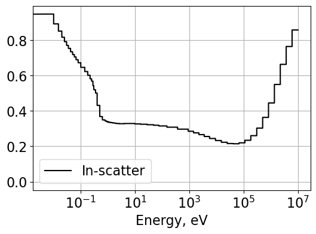
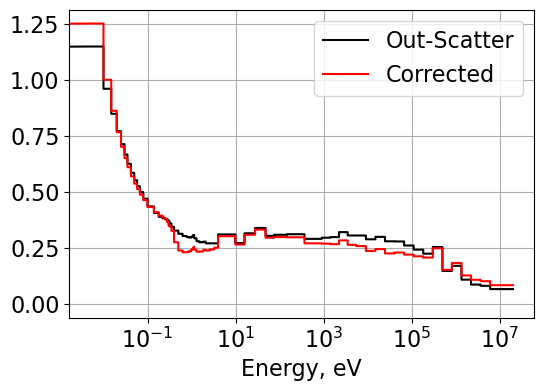

:orphan:

.. _FA_diffusion:

Fuel Assembly Diffusion
=======================

Return to Project 3 documentation: :ref:`proj3`

.. code:: python

    # import relevant packages
    import numpy as np
    from scipy.linalg import solve
    import matplotlib.pyplot as plt
    from matplotlib import rcParams
    
    # Default values
    FONT_SIZE = 16  # font size for plotting purposes
    # rcParams['figure.dpi'] = 300
    plt.rcParams['figure.figsize'] = [6, 4] # Set default figure size

.. code:: python

    import serpentTools
    from serpentTools.settings import rc
    from plotter import Plot1d
    from numerical_TCR import InScatter, OutScatter, FluxLimited, Condense2gr

Transport cross section
=======================

Description
-----------

**In-scatter**

:math:`\Sigma_{tr,g} = \Sigma_{t,g} - \frac{{\sum}_{g'}\Sigma_{s1,g'g}J_{g'}}{J_g}`

**Out-scatter**

:math:`\Sigma_{tr,g} \approx \Sigma_{t,g} - \frac{{\sum}_{g'}\Sigma_{s1,gg'}J_{g}}{J_g}=\Sigma_{t,g}-\Sigma_{s1,g}`

**Flux-limited**

:math:`\Sigma_{tr,g} = \Sigma_{t,g} - \frac{{\sum}_{g'}\Sigma_{s1,g'g}\phi_{g'}}{\phi_g}`

Obtain the **current**

:math:`\Sigma_{t,h}J_h-{\sum}_{h'}\Sigma_{s1,h'h}J_{h'}=\frac{1}{3}B\phi_h`

Read results from Serpent
~~~~~~~~~~~~~~~~~~~~~~~~~

.. code:: python

    # 70-group Infinite Results
    resFile70gr = "./serpent/fa2D_70gr_inf_res.m"
    # 2-Group B1 Leakage Corrected Reference Results
    resFile2gr = "./serpent/fa2D_2gr_B1_res.m"
    # 70-group Infinite Hydrogen Results
    resFile70grH = "./serpent/infinite_h_basic_h1_r1_res.m"

.. code:: python

    # Read the results using the serpentTools package 
    rc["serpentVersion"] = "2.2.1"
    res70gr = serpentTools.read(resFile70gr)
    res2gr = serpentTools.read(resFile2gr)
    res70grH = serpentTools.read(resFile70grH)

.. parsed-literal::

    SERPENT Serpent 2.1.32 found in ./serpent/infinite_h_basic_h1_r1_res.m, but version 2.2.1 is defined in settings
      Attempting to read anyway. Please report strange behaviors/failures to developers.
    

.. code:: python

    # 70-group fuel assembly data
    ng = 70
    univ0 = res70gr.getUniv('0', timeDays=0)
    flxLat = univ0.infExp['infFlx']
    sigTLat = univ0.infExp['infTot']
    SP1Lat = univ0.infExp['infSp1']
    cmmTranspLat = univ0.gc['cmmTranspxs']      # represents in-scatter
    infTranspLat = univ0.infExp['infTranspxs']  # out-scatter
    energyLat = univ0.groups * 1e6

.. code:: python

    # Retrieve the reference diffusion coefficients for 2-groups
    univ0 = res2gr.getUniv('0', timeDays=0)
    cmmDiffCoeff2g = univ0.gc['cmmDiffcoef']

.. code:: python

    # using the serpent results to get infinite TCR
    cmmTauLat = cmmTranspLat / sigTLat

**To create the scattering matrix with the following structure**: 1->1,
2->1 3->1 … 1->2, 2->2 3->2 … 1->3, 2->3 3->3 … …

.. code:: python

    SP1Lat=SP1Lat.reshape((ng,ng)).transpose()

**Execute in-scatter function**

.. code:: python

    inSigTrLat, inTauLat, JgLat  = InScatter(ng, SP1Lat, sigTLat, flxLat, B2=1E-06)

**Execute the out-scatter**

.. code:: python

    outSigTrLat, outTauLat = OutScatter(ng, SP1Lat, sigTLat)

**Execute the flux-limited**

.. code:: python

    limitSigTrLat, limitTauLat  = FluxLimited(ng, SP1Lat, sigTLat, flxLat)

A 2-group energy structure is defined for fast and thermal neutrons with group 1 (fast) having energies > 0.625 eV and group 2 (thermal) having energies :math:`\le` 0.625 eV.
~~~~~~~~~~~~~~~~~~~~~~~~~~~~~~~~~~~~~~~~~~~~~~~~~~~~~~~~~~~~~~~~~~~~~~~~~~~~~~~~~~~~~~~~~~~~~~~~~~~~~~~~~~~~~~~~~~~~~~~~~~~~~~~~~~~~~~~~~~~~~~~~~~~~~~~~~~~~~~~~~~~~~~~~~~~~~~

.. code:: python

    # Find the energy cutoff index
    energyCutoff = 0.625 # energy cutoff value defining neutron energy group [eV]
    g1Indices = np.where(energyLat > 0.625)[0]
    g2Indices = np.where(energyLat <= 0.625)[0]

Diffusion Coefficient Group Condensation
~~~~~~~~~~~~~~~~~~~~~~~~~~~~~~~~~~~~~~~~

Determine the 2-group diffusion coefficients for in-scatter,
out-scatter, and flux-limited defined transport cross sections.

.. code:: python

    inDiffCoeff2g = Condense2gr(1/(3*inSigTrLat), flxLat, energyLat, cutoffE=0.625)
    outDiffCoeff2g = Condense2gr(1/(3*outSigTrLat), flxLat, energyLat, cutoffE=0.625)
    limitDiffCoeff2g = Condense2gr(1/(3*limitSigTrLat), flxLat, energyLat, cutoffE=0.625)

.. code:: python

    print(f"The 2-group diffusion coefficients for the in-scatter method are {inDiffCoeff2g} with relative errors of {100*(inDiffCoeff2g-cmmDiffCoeff2g)/cmmDiffCoeff2g}%.")
    print(f"The 2-group diffusion coefficients for the out-scatter method are {outDiffCoeff2g} with relative errors of {100*(outDiffCoeff2g-cmmDiffCoeff2g)/cmmDiffCoeff2g}%.")
    print(f"The 2-group diffusion coefficients for the flux-limited method are {limitDiffCoeff2g} with relative errors of {100*(limitDiffCoeff2g-cmmDiffCoeff2g)/cmmDiffCoeff2g}%.")

.. parsed-literal::

    The 2-group diffusion coefficients for the in-scatter method are [1.69854949 0.88303605] with relative errors of [-3.38501006 -0.56684185]%.
    The 2-group diffusion coefficients for the out-scatter method are [1.73376106 0.82629467] with relative errors of [-1.38214492 -6.95613244]%.
    The 2-group diffusion coefficients for the flux-limited method are [1.68208348 0.87193724] with relative errors of [-4.32161155 -1.8166092 ]%.
    

Read 70-group data from infinite hydrogen assembly to perform hydrogen correction for out-scatter calculated :math:`\Sigma_{tr}`
~~~~~~~~~~~~~~~~~~~~~~~~~~~~~~~~~~~~~~~~~~~~~~~~~~~~~~~~~~~~~~~~~~~~~~~~~~~~~~~~~~~~~~~~~~~~~~~~~~~~~~~~~~~~~~~~~~~~~~~~~~~~~~~~

.. code:: python

    univ0 = res70grH.getUniv('0', timeDays=0)
    flxH = univ0.infExp['infFlx']
    sigTH = univ0.infExp['infTot']
    SP1H = univ0.infExp['infSp1']
    cmmTranspH = univ0.gc['cmmTranspxs']      # represents in-scatter
    infTranspH = univ0.infExp['infTranspxs']  # out-scatter
    energyH = univ0.groups * 1e6

.. code:: python

    SP1H=SP1H.reshape((ng,ng)).transpose()
    
    # Calculate the in-scatter method transport correction factor for H-1
    inSigTrH, inTauH, JgH  = InScatter(ng, SP1H, sigTH, flxH, B2=1E-04)
    
    # Calculate the microscopic transport cross section using out-scatter macroscopic transport cross section
    outSigTrH, outTauH = OutScatter(ng, SP1H, sigTH)
    numberDensInf = 4.29318E+23 # from N = rho*Avagadro/(mass_H)
    outMicroTrH = infTranspH/numberDensInf
    
    # Remove the hydrogen generated transport xs from the lattice transport xs
    numberDensLat = 2.7496E+22 # hydrogen number density smeared over lattice
    outSigTrLatMinus = infTranspLat - outMicroTrH * numberDensLat
    
    # Find microscopic total cross section for hydrogen
    microTotalH = sigTH/numberDensInf
    outSigTrLatCorrected = outSigTrLatMinus + microTotalH * numberDensLat * inTauH
    

Calculate the corrected 2-group diffusion coefficients for the out-scatter method
~~~~~~~~~~~~~~~~~~~~~~~~~~~~~~~~~~~~~~~~~~~~~~~~~~~~~~~~~~~~~~~~~~~~~~~~~~~~~~~~~

.. code:: python

    outDiffCoeff2gCorrected = Condense2gr(1/(3*outSigTrLatCorrected), flxLat, energyLat, cutoffE=0.625)
    print(f"The 2-group diffusion coefficients for the corrected out-scatter method are {outDiffCoeff2gCorrected} with relative errors of {100*(outDiffCoeff2gCorrected-cmmDiffCoeff2g)/cmmDiffCoeff2g}%.")

.. parsed-literal::

    The 2-group diffusion coefficients for the corrected out-scatter method are [1.71873483 0.8845672 ] with relative errors of [-2.23685006 -0.3944285 ]%.
    

.. code:: python

    # Plot in-scatter TCR used for hydrogen correction
    plt.figure()
    Plot1d(energyH, inTauH, xlabel="Energy, eV", ylabel='',
            fontsize=16, marker="-k", markerfill=False, markersize=6)
    plt.legend(['In-scatter'])

.. parsed-literal::

    <matplotlib.legend.Legend at 0x2f60c037950>

.. code:: python

    # Plot hydrogen corrected out-scatter transport cross sections
    plt.figure()
    plt.grid(visible=True)
    Plot1d(energyLat, outSigTrLat, xlabel="Energy, eV", ylabel='',
            fontsize=16, marker="-k", markerfill=False, markersize=6)
    Plot1d(energyLat, outSigTrLatCorrected, xlabel="Energy, eV", ylabel='',
            fontsize=16, marker="-r", markerfill=False, markersize=6)
    plt.legend(['Out-Scatter', 'Corrected'])

.. parsed-literal::

    <matplotlib.legend.Legend at 0x2f60dfd2590>

