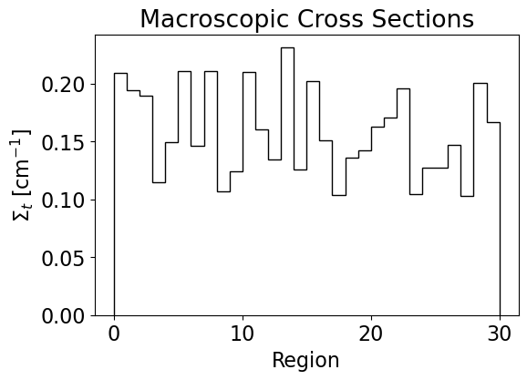
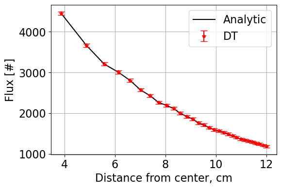
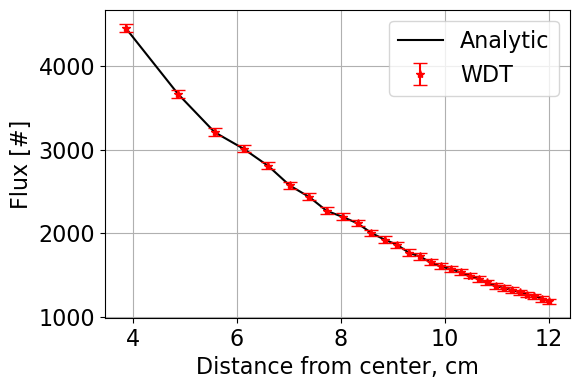
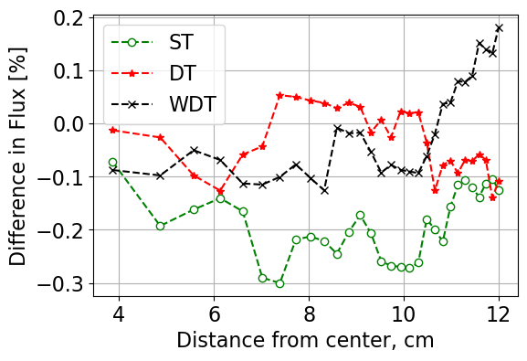

:orphan:

.. _montecarlojupyternotebook:

================================
Weighted Delta Tracking Notebook
================================

Return to :ref:`proj1` documentation.

.. code:: python

    # import relevant packages
    import matplotlib.pyplot as plt
    import numpy as np
    plt.rcParams['font.size'] = 16

.. code:: python

    %matplotlib inline
    plt.rcParams['figure.figsize'] = [6, 4] # Set default figure size

Neutron Transport with Monte Carlo
==================================

Description
-----------

The purpose of this workshop is to implement **two techniques** that are
used in Monte Carlo codes: 1. Surface (ray-tracing) - **ST** 2. Delta
tracking - **DT**.

Problem set-up
~~~~~~~~~~~~~~

We will have a point source (located at the origin) surrounded with
multiple shells of heterogeneous materials having unique cross sections.
Our objectives are to calculate the: - Flux distribution, which for
simplicity is defined as the neutrons crossing a certain surface -
Leakage from the system (i.e., sphere)

Set of exercises
----------------

You are required to complete the following exercises: 1. Analytic
solution 2. Ray-tracing 3. Delta tracking

Analytic solution
~~~~~~~~~~~~~~~~~

The programming will be done within the ``pointsource_sphere.py`` file.
Note that we use object-oriented programming. This is not mandatory and
only done here as a means of demonestration.

Open the file to familiarize yourself with the ``__init__`` method. This
is done together with the lecturer. Note that the entire volume is
divided to equal-volume shells, according to which the corresponding
radii are calculated. Also, the total and absorption cross sections are
identical (i.e., no scattering)

**Complete** the ``_Analytic`` function that enables to calculate the
analytic solution.

The *analytic solution* can be derived as:

:math:`\frac{I(R_i)}{I_0}={\prod}_{j=1}^i e^{-\Sigma_{t,j}\Delta R_j}`

with the *leakage calculated* when :math:`i` represents the last shell
(i.e., :math:`R_{sphere}`)

**Import the class**:

.. code:: python

       >>> mc = PointSourceInSphere(nMC, S0, R, sigT)

where, - ``nMC`` is the number of Monte Carlo repetitive simulations -
``S0`` is the number of source neutrons - ``R`` is the radius of the
sphere in cm - ``sigT`` total cross section array for all the different
regions

**results** are stored under the ``resAN``, ``resST``, ``resDT``
dictionaries on the created ``mc`` object.

**Define inputs and execute analytic solution**

.. code:: python

    from pointsource_sphere import PointSourceInSphere

.. code:: python

    xs = np.random.uniform(low = 0.1, high = 0.25, size = (30))
    # xs[6] = 3
    mc = PointSourceInSphere(100, 10000, 12.0, xs) # np.full(10, 0.1)
    print(xs)

.. parsed-literal::

    [0.1001577  0.24530646 0.13664874 0.17337634 0.22243201 0.116862
     0.24406138 0.19113768 0.24014224 0.18559167 0.13206509 0.15422328
     0.16250685 0.18396762 0.19339512 0.15167535 0.1241924  0.163639
     0.1427731  0.16122647 0.1301141  0.17603432 0.15403576 0.23975469
     0.13041069 0.23468564 0.22490938 0.17498096 0.12517552 0.1557442 ]
    

.. code:: python

    plt.hist(xs, edgecolor = "black")
    plt.title("Macroscopic Cross Sections")
    plt.xlabel(r"$\Sigma_t$ [cm$^{-1}]$")
    plt.ylabel("Count")
    plt.show()

.. code:: python

    mc.Solve('analytic')

.. code:: python

    mc.resAN

.. parsed-literal::

    {'flx': array([6792.23679884, 5309.72841784, 4822.63356824, 4375.98125962,
            3938.64253733, 3752.71668664, 3428.67300092, 3215.24031022,
            2985.09278502, 2830.17927413, 2731.55169414, 2627.12087817,
            2527.0093459 , 2423.60282792, 2324.20390758, 2252.32507449,
            2197.4362569 , 2129.81343422, 2074.57290141, 2015.97604744,
            1971.39051637, 1914.44518245, 1867.39692943, 1798.44646182,
            1763.00554365, 1702.58105621, 1648.01216105, 1607.76355352,
            1580.23325575, 1547.39283243]),
     'leakage': np.float64(0.15473928324256722)}

.. code:: python

    print("Leakage = {:.2f} %".format(100*mc.resAN['leakage']))

.. parsed-literal::

    Leakage = 15.47 %
    

.. code:: python

    # Sanity check
    print("Expected leakage = {:.2f} %".format(100*np.exp(-12*0.1)))

.. parsed-literal::

    Expected leakage = 30.12 %
    

Ray-tracing
~~~~~~~~~~~

Complete the ``_SolveST`` method. Note that the sampling of the point
source should not be performed at all as it is known that all the
neutrons are born in the origin. However, the purpose was to describe
the general sampling approach within the sphere.

Also, all the source neutrons are sampled simultaneously (vectorized) as
opposed to one-by-one. **The general approach of ST is**: 1. Sample
:math:`x_0`, :math:`y_0`, :math:`z_0` 2. Sample distance traveled
:math:`S_i` 3. Update the position :math:`x_1`, :math:`y_1`, :math:`z_1`
4. Check if the position is within the shell where the neutrons
originated or not - If within the shell, then terminate the neutron -
Otherwise, promote the neutron in the same direction to the end of the
shell and update :math:`x_0`, :math:`y_0`, :math:`z_0` and go to step 2.
5. If the neutron crossses the last shell terminate it 6. Our scoring is
fairly random here and we will be scoring neutrons that crossed a
specific surface. This is easy to do with ST and in this specific case
even easier as all the neutrons are traveling in the radial direction
only and no scattering events are happening.

**Define inputs and execute ST solution**

.. code:: python

    mc.Solve('ST')

.. code:: python

    mc.resST

.. parsed-literal::

    {'flx': array([6804.05, 5317.14, 4827.56, 4381.31, 3942.58, 3756.79, 3432.88,
            3219.82, 2990.41, 2835.94, 2738.38, 2635.04, 2534.26, 2431.67,
            2330.14, 2258.55, 2204.37, 2137.71, 2082.44, 2022.84, 1978.08,
            1920.93, 1873.65, 1804.81, 1769.21, 1707.42, 1653.21, 1612.46,
            1583.82, 1551.58]),
     'fluxsim': array([[6756., 6815., 6761., ..., 6846., 6845., 6724.],
            [5268., 5313., 5249., ..., 5289., 5355., 5271.],
            [4789., 4832., 4780., ..., 4838., 4845., 4807.],
            ...,
            [1589., 1604., 1608., ..., 1642., 1667., 1616.],
            [1564., 1573., 1581., ..., 1606., 1635., 1588.],
            [1530., 1540., 1553., ..., 1571., 1597., 1556.]], shape=(30, 100)),
     'errflx': array([43.80670611, 51.39202662, 51.10994424, 48.92171195, 50.00703551,
            48.80169977, 47.64541531, 45.18547997, 43.62570229, 43.09496954,
            41.64823646, 41.34753197, 38.40901457, 38.15024377, 36.75840584,
            35.81741895, 34.97331983, 34.47471392, 34.06649967, 33.67483333,
            33.29765157, 33.24251946, 33.7073805 , 32.34553911, 31.57603363,
            30.75131867, 31.83843432, 32.46980751, 32.36954742, 32.62060085]),
     'leakage': np.float64(0.15515800000000002),
     'errleakage': np.float64(0.0032620600852835305)}

.. code:: python

    print(np.std(mc.resST['fluxsim'][0]))
    print(np.mean(np.abs((mc.resST['flx'])-(mc.resAN['flx'])))/(mc.resAN['flx']))
    
    

.. parsed-literal::

    43.806706107626944
    [0.00090125 0.00115289 0.00126933 0.00139889 0.00155422 0.00163122
     0.00178539 0.00190391 0.0020507  0.00216294 0.00224104 0.00233012
     0.00242244 0.00252579 0.00263381 0.00271787 0.00278575 0.0028742
     0.00295074 0.0030365  0.00310518 0.00319754 0.0032781  0.00340378
     0.00347221 0.00359543 0.00371449 0.00380747 0.00387381 0.00395602]
    

.. code:: python

    mc.PlotFluxes('ST')

.. image:: images/monte_carlo_results/case3STflux.png

.. code:: python

    print("Analytic Leakage = {:.2f} %".format(100*mc.resAN['leakage']))
    print("MC/ST Leakage = {:.2f} %".format(100*mc.resST['leakage']))

.. parsed-literal::

    Analytic Leakage = 15.47 %
    MC/ST Leakage = 15.52 %
    

Delta tracking
~~~~~~~~~~~~~~

Complete the ``_SolveDT`` method.

**The general approach of DT is**: 1. Sample :math:`x_0`, :math:`y_0`,
:math:`z_0` 2. Sample virtual distance traveled :math:`S_i` using the
majorant cross section. 3. Update the position :math:`x_1`, :math:`y_1`,
:math:`z_1` 4. Accept the virtual collision as a real one by sampling
uniformly from [0, 1] and comparing to the :math:`\Sigma_t/\Sigma_{maj}`
- If virtual collision accepted (i.e. a real collision occurred), then
terminate the neutron - Otherwise, use the new position as :math:`x_0`,
:math:`y_0`, :math:`z_0` and go to step 2.

**Define inputs and execute ST solution**

.. code:: python

    mc.Solve('DT')

.. code:: python

    mc.resDT

.. parsed-literal::

    {'flx': array([6794.78, 5308.93, 4818.47, 4372.35, 3936.42, 3750.66, 3428.73,
            3214.5 , 2983.32, 2827.64, 2729.1 , 2625.43, 2527.19, 2422.75,
            2325.28, 2252.2 , 2196.9 , 2130.59, 2075.79, 2017.7 , 1971.81,
            1915.89, 1869.63, 1800.63, 1764.28, 1705.2 , 1649.95, 1609.74,
            1581.72, 1548.59]),
     'fluxsim': array([[6746., 6760., 6883., ..., 6824., 6708., 6823.],
            [5315., 5278., 5401., ..., 5314., 5202., 5318.],
            [4819., 4790., 4889., ..., 4828., 4727., 4811.],
            ...,
            [1610., 1554., 1618., ..., 1656., 1599., 1656.],
            [1577., 1523., 1591., ..., 1620., 1571., 1623.],
            [1546., 1497., 1566., ..., 1579., 1546., 1591.]], shape=(30, 100)),
     'errflx': array([47.50296412, 54.29295627, 52.57593651, 53.3729098 , 51.42337601,
            52.65723502, 54.91627354, 54.30883906, 51.32073265, 49.30345221,
            50.27096578, 46.76991661, 45.77459885, 44.98741491, 44.23642843,
            41.55694888, 40.54910603, 40.6396592 , 41.52090919, 41.10145983,
            41.46581604, 40.55265589, 40.98796287, 40.33872953, 39.57400157,
            38.31083398, 36.95520938, 36.11969546, 35.40567186, 34.75027914]),
     'leakage': np.float64(0.154859),
     'errleakage': np.float64(0.0034750279135569535)}

.. code:: python

    print(np.std(mc.resDT['fluxsim'][0]))

.. parsed-literal::

    47.50296411804215
    

.. code:: python

    mc.PlotFluxes('DT')

Weighted Delta tracking
~~~~~~~~~~~~~~~~~~~~~~~

.. code:: python

    mc.Solve('wdt')

.. code:: python

    mc.resWDT

.. parsed-literal::

    {'flx': array([6792.04265786, 5314.43065786, 4826.78073402, 4380.50180601,
            3942.89278974, 3756.74802999, 3430.67170231, 3218.33504717,
            2987.87017047, 2832.13629052, 2732.95352074, 2628.11716643,
            2527.24854061, 2424.56506084, 2324.01140579, 2252.26025819,
            2197.08362733, 2129.25424065, 2073.82327713, 2014.78855142,
            1970.59615981, 1913.263707  , 1865.43220038, 1796.47969024,
            1761.59865691, 1700.94228579, 1646.2113917 , 1605.98254835,
            1578.49698119, 1546.47642238]),
     'fluxsim': array([[6719.45389855, 6781.10291923, 6785.46103476, ..., 6788.18245094,
             6795.67208711, 6804.2760478 ],
            [5283.77106551, 5277.35202785, 5291.46172668, ..., 5272.00577991,
             5309.02695805, 5278.16029668],
            [4788.81749607, 4799.64144118, 4814.60293046, ..., 4798.74256932,
             4821.417972  , 4811.50190581],
            ...,
            [1580.76313154, 1613.14782101, 1583.10873522, ..., 1597.10809609,
             1620.43889207, 1574.88283747],
            [1552.86483339, 1589.72048029, 1560.58995791, ..., 1569.10778227,
             1596.70158823, 1547.81930338],
            [1525.21531175, 1554.62002756, 1533.52909093, ..., 1540.42166307,
             1564.4752873 , 1519.56155598]], shape=(30, 100)),
     'errflx': array([34.14347062, 41.12309217, 39.05960755, 38.94947025, 39.56659299,
            38.18744016, 38.49054524, 37.3352865 , 38.41194481, 37.4671756 ,
            36.72014899, 36.69297015, 36.36485655, 34.91086451, 34.49571066,
            33.95676986, 33.12171791, 32.6284291 , 32.45204713, 32.880467  ,
            32.71928672, 32.58150959, 32.1368518 , 31.79327865, 31.2677748 ,
            29.74636004, 28.33795562, 28.49143501, 27.97191187, 27.90330159]),
     'leakage': np.float64(0.1546476422375583),
     'errleakage': np.float64(0.002790330158587489)}

.. code:: python

    print(np.std(mc.resWDT['fluxsim'][0]))

.. parsed-literal::

    34.14347061579633
    

.. code:: python

    mc.PlotFluxes('WDT')

.. code:: python

    print("Analytic Leakage = {:.2f} %".format(100*mc.resAN['leakage']))
    print("MC/ST Leakage = {:.2f} %".format(100*mc.resST['leakage']))
    print("MC/DT Leakage = {:.2f} %".format(100*mc.resDT['leakage']))
    print("MC/WDT Leakage = {:.2f} %".format(100*mc.resWDT['leakage']))

.. parsed-literal::

    Analytic Leakage = 15.47 %
    MC/ST Leakage = 15.52 %
    MC/DT Leakage = 15.49 %
    MC/WDT Leakage = 15.46 %
    

**Execution times**

.. code:: python

    print("ST = {:.2f}".format(mc.times['ST']))
    print("DT = {:.2f}".format(mc.times['DT']))
    print("WDT = {:.2f}".format(mc.times['WDT']))

.. parsed-literal::

    ST = 45.28
    DT = 23.55
    WDT = 32.26
    

.. code:: python

    mc.PlotDifferences()

Return to top of notebook: :ref:`montecarlojupyternotebook`
