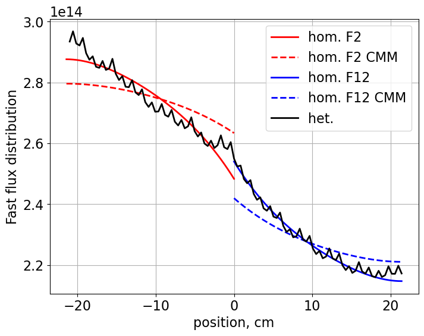
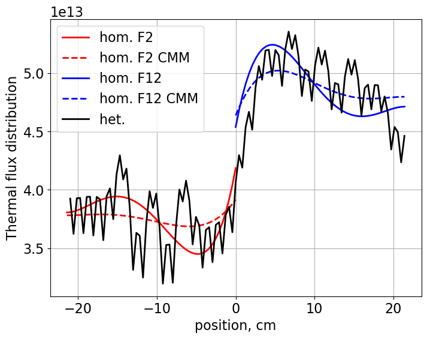
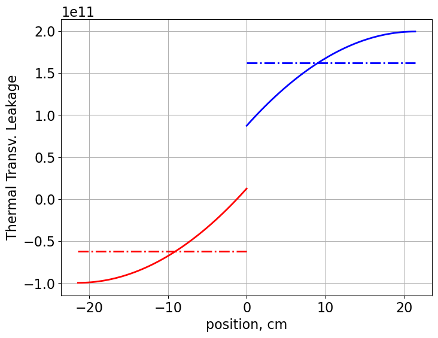

:orphan:

.. _NEMnotebook:

Nodal Expansion Method and Discontinuity Factors
====================================================================

Return to Project 4 documentation: :ref:`proj4`

.. code:: python

    from IPython.display import Image
    import matplotlib.pyplot as plt
    from matplotlib import rcParams
    import numpy as np
    import time
    # Default values
    FONT_SIZE = 16  # font size for plotting purposes
    plt.rcParams['figure.figsize'] = [8, 6] # Set default figure size

.. code:: python

    from NEM import CartesianNem1D, GetSerpentRes, Plot1d
    import serpentTools

Colorset 2-dim test case
------------------------

.. code:: python

    case = 'SMR'  # 'SMR' or 'PWR'

.. code:: python

    imgFile = './serpent/{}/{}_Ref_2D_2g_geom1.png'.format(case, case)
    resFile = './serpent/{}/{}_Ref_2D_2g_res.m'.format(case, case)
    detFile = './serpent/{}/{}_Ref_2D_2g_det0.m'.format(case, case)

.. code:: python

    Image(imgFile,  width=400, height=300)

.. image:: NEM_DF_files/NEM_DF_6_0.png
   :width: 400px
   :height: 300px

**Universes** within the colorset: - Upper left **F12** - 2.6%
:math:`UO_2` - Upper right **Ref** - stainless steel (with water for
PWR) - Bottom left **F2** - 4.55% :math:`UO_2` with 8% :math:`Gd_2`
:math:`O_3` - Bottom right **F11** - 2.6% :math:`UO_2`

Read detector data from Serpent
^^^^^^^^^^^^^^^^^^^^^^^^^^^^^^^

.. code:: python

    det = serpentTools.read(detFile) 

The values in the detectors are defined on a 102 over 102 grid. The
following lines obtain the x-direction y-averaged fluxes

For example, ``det.detectors['flux_fast'].tallies`` obtains the fast
flux with dimensions of 102x102. The ``.mean(axis=0)`` operation
averages over the columns (y-averaged). If one wants to change to x
averaged, ``.mean(axis=1)`` needs to be used.

.. code:: python

    solvecolumn = 1

.. code:: python

    tally = det.detectors['flux_fast'].x[:, 1]
    
    if solvecolumn == 1:
        fastHetFlux = det.detectors['flux_fast'].tallies[:,0:51].mean(axis=1)
        thermalHetFlux = det.detectors['flux_thermal'].tallies[:,0:51].mean(axis=1)
        universes = ['F2', 'F12']
    else:
        fastHetFlux = det.detectors['flux_fast'].tallies[:,51:].mean(axis=1)
        thermalHetFlux = det.detectors['flux_thermal'].tallies[:,51:].mean(axis=1)
        universes = ['F11', 'Ref']
    
    # Check shape to verify mesh slicing
    print(det.detectors['flux_fast'].tallies.shape)

.. parsed-literal::

    (102, 102)
    

Read results data from Serpent
^^^^^^^^^^^^^^^^^^^^^^^^^^^^^^

.. code:: python

    xs1, bc1 = GetSerpentRes(resFile, universes[0], timeDays=0)
    xs2, bc2 = GetSerpentRes(resFile, universes[1], timeDays=0)

.. parsed-literal::

    SERPENT Serpent 2.2.1 found in ./serpent/SMR/SMR_Ref_2D_2g_res.m, but version 2.1.31 is defined in settings
      Attempting to read anyway. Please report strange behaviors/failures to developers.
    SERPENT Serpent 2.2.1 found in ./serpent/SMR/SMR_Ref_2D_2g_res.m, but version 2.1.31 is defined in settings
      Attempting to read anyway. Please report strange behaviors/failures to developers.
    

.. code:: python

    dx, dy = 21.42, 21.42  # cm  - assembly length

Transverse leakage
~~~~~~~~~~~~~~~~~~

**Bottom** Fuel Assembly

.. code:: python

    trLeakage1 = {}
    trLeakage1['nL'] = bc2['eJnet'] - bc2['wJnet']
    trLeakage1['nD'] = xs2['diff']
    trLeakage1['ndy'] = dy
    trLeakage1['sL'] = bc1['eJnet'] - bc1['wJnet']
    trLeakage1['sD'] = xs1['diff']
    trLeakage1['sdy'] = dy

Solve the bottom fuel assembly node
^^^^^^^^^^^^^^^^^^^^^^^^^^^^^^^^^^^

.. code:: python

    time_start = time.perf_counter()
    nem1 = CartesianNem1D(dx, dy, xs1, bc1, trLeakage1, symbolic=False)
    nem1.TransverseLeakageCoef('y')  # obtain the coefficients of the TL
    nem1.GetExpansionCoeffs('y', 'diff')
    time_end = time.perf_counter()
    print('Assembly solution calculated in {} seconds'.format(time_end-time_start))

.. parsed-literal::

    Assembly solution calculated in 0.07377529999939725 seconds
    

.. code:: python

    xvals = np.linspace(-dx/2, +dx/2, 51)
    yvals = np.linspace(-dy/2, +dy/2, 51)
    flux1 = nem1.GetHomogFlux(yvals)

Change cross section data to compare against CMM transport cross
section.

.. code:: python

    trLeakage1['nD'] = xs2['cmmdiff']
    trLeakage1['sD'] = xs1['cmmdiff']
    
    nem1CMM = CartesianNem1D(dx, dy, xs1, bc1, trLeakage1, symbolic=False)
    nem1CMM.TransverseLeakageCoef('y')  # obtain the coefficients of the TL
    nem1CMM.GetExpansionCoeffs('y', 'cmmdiff')
    
    flux1CMM = nem1CMM.GetHomogFlux(yvals)

Transverse leakage
~~~~~~~~~~~~~~~~~~

**Top** fuel assembly.

.. code:: python

    trLeakage2 = {}
    trLeakage2['sL'] = bc1['eJnet'] - bc1['wJnet']
    trLeakage2['sD'] = xs1['diff']
    trLeakage2['sdy'] = dy
    trLeakage2['nL'] = bc2['eJnet'] - bc2['wJnet']
    trLeakage2['nD'] = xs2['diff']
    trLeakage2['ndy'] = dy

Solve the top fuel assembly node
^^^^^^^^^^^^^^^^^^^^^^^^^^^^^^^^

.. code:: python

    time_start1 = time.perf_counter()
    nem2 = CartesianNem1D(dx, dy, xs2, bc2, trLeakage2, symbolic=True)
    nem2.TransverseLeakageCoef('y')  # obtain the coefficients of the TL
    nem2.GetExpansionCoeffs('y', 'diff')
    time_end1 = time.perf_counter()
    print('Assembly solution calculated in {} seconds'.format(time_end1-time_start1))

.. parsed-literal::

    Assembly solution calculated in 0.07840810000197962 seconds
    

.. code:: python

    xvals = np.linspace(-dx/2, +dx/2, 51)
    yvals = np.linspace(-dy/2, +dy/2, 51)
    flux2 = nem2.GetHomogFlux(yvals)

.. code:: python

    trLeakage2['sD'] = xs1['cmmdiff']
    trLeakage2['nD'] = xs2['cmmdiff']
    
    nem2CMM = CartesianNem1D(dx, dy, xs2, bc2, trLeakage2, symbolic=False)
    nem2CMM.TransverseLeakageCoef('y')  # obtain the coefficients of the TL
    nem2CMM.GetExpansionCoeffs('y', 'cmmdiff')
    
    flux2CMM = nem2CMM.GetHomogFlux(yvals)

Plot results
^^^^^^^^^^^^

1. **Fast** flux distribution
2. **Thermal** flux distribution

.. code:: python

    plt.figure()
    Plot1d(xvals-10.71, flux1[0,:], xlabel="position, cm", 
           ylabel='Flux distribution',
           fontsize=16, marker="-r", markersize=6)
    Plot1d(xvals-10.71, flux1CMM[0,:], xlabel="position, cm", 
           ylabel='Flux distribution',
           fontsize=16, marker="--r", markersize=6)
    Plot1d(xvals+10.71, flux2[0,:], xlabel="position, cm", 
           ylabel='Flux distribution',
           fontsize=16, marker="-b", markersize=6)
    Plot1d(xvals+10.71, flux2CMM[0,:], xlabel="position, cm", 
           ylabel='Flux distribution',
           fontsize=16, marker="--b", markersize=6)
    Plot1d(tally, fastHetFlux, xlabel="position, cm", 
           ylabel='Fast flux distribution',
           fontsize=16, marker="-k", markersize=6)
    plt.legend(['hom. {}'.format(universes[0]), 'hom. {} CMM'.format(universes[0]) , 'hom. {}'.format(universes[1]), 'hom. {} CMM'.format(universes[1]),'het.'])

.. parsed-literal::

    <matplotlib.legend.Legend at 0x28b378f5bd0>

.. code:: python

    plt.figure()
    Plot1d(xvals-10.71, flux1[1,:], xlabel="position, cm", 
           ylabel='Flux distribution',
           fontsize=16, marker="-r", markersize=6)
    Plot1d(xvals-10.71, flux1CMM[1,:], xlabel="position, cm", 
           ylabel='Flux distribution',
           fontsize=16, marker="--r", markersize=6)
    Plot1d(xvals+10.71, flux2[1,:], xlabel="position, cm", 
           ylabel='Flux distribution',
           fontsize=16, marker="-b", markersize=6)
    Plot1d(xvals+10.71, flux2CMM[1,:], xlabel="position, cm", 
           ylabel='Flux distribution',
           fontsize=16, marker="--b", markersize=6)
    Plot1d(tally, thermalHetFlux, xlabel="position, cm", 
           ylabel='Thermal flux distribution',
           fontsize=16, marker="-k", markersize=6)
    plt.legend(['hom. {}'.format(universes[0]), 'hom. {} CMM'.format(universes[0]) , 'hom. {}'.format(universes[1]), 'hom. {} CMM'.format(universes[1]),'het.'])

.. parsed-literal::

    <matplotlib.legend.Legend at 0x28b39edb310>

Reference Discontinuity Factors (RDF)
~~~~~~~~~~~~~~~~~~~~~~~~~~~~~~~~~~~~~

.. code:: python

    print('South {}'.format(universes[0]))
    print('gr1={:.3f}, gr2={:.3f} NEM'.format(nem1.southDFs[0], nem1.southDFs[1]))
    print('gr1={:.3f}, gr2={:.3f} Serpent'.format(nem1.bc['sDF'][0], nem1.bc['sDF'][1]))

.. parsed-literal::

    South F2
    gr1=1.017, gr2=1.074 NEM
    gr1=1.026, gr2=1.063 Serpent
    

.. code:: python

    print('North {}'.format(universes[0]))
    print('gr1={:.3f}, gr2={:.3f} NEM'.format(nem1.northDFs[0], nem1.northDFs[1]))
    print('gr1={:.3f}, gr2={:.3f} Serpent'.format(nem1.bc['nDF'][0], nem1.bc['nDF'][1]))

.. parsed-literal::

    North F2
    gr1=1.018, gr2=1.034 NEM
    gr1=1.006, gr2=1.057 Serpent
    

.. code:: python

    print('South {}'.format(universes[1]))
    print('gr1={:.3f}, gr2={:.3f} NEM'.format(nem2.southDFs[0], nem2.southDFs[1]))
    print('gr1={:.3f}, gr2={:.3f} Serpent'.format(nem2.bc['sDF'][0], nem2.bc['sDF'][1]))

.. parsed-literal::

    South F12
    gr1=0.995, gr2=0.954 NEM
    gr1=1.006, gr2=0.951 Serpent
    

.. code:: python

    print('North {}'.format(universes[1]))
    print('gr1={:.3f}, gr2={:.3f} NEM'.format(nem2.northDFs[0], nem2.northDFs[1]))
    print('gr1={:.3f}, gr2={:.3f} Serpent'.format(nem2.bc['nDF'][0], nem2.bc['nDF'][1]))

.. parsed-literal::

    North F12
    gr1=1.008, gr2=0.974 NEM
    gr1=0.997, gr2=0.973 Serpent
    

Transverse leakage
~~~~~~~~~~~~~~~~~~

Obtain the transverse leakages

.. code:: python

    trl1 = nem1.GetTrVals(yvals)
    trl2 = nem2.GetTrVals(yvals)

.. code:: python

    avTrL1 = (bc1['eJnet'] - bc1['wJnet'])/dx
    avTrL2 = (bc2['eJnet'] - bc2['wJnet'])/dx

.. code:: python

    plt.figure()
    Plot1d(xvals-10.71, np.full(51, avTrL1[0]), xlabel=None, 
           ylabel=None,
           fontsize=16, marker="-.r", markersize=6)
    Plot1d(xvals+10.71, np.full(51, avTrL2[0]), xlabel=None, 
           ylabel=None,
           fontsize=16, marker="-.b", markersize=6)
    Plot1d(xvals-10.71, trl1[0,:], xlabel=None, 
           ylabel=None,
           fontsize=16, marker="-r", markersize=6)
    Plot1d(xvals+10.71, trl2[0,:], xlabel='position, cm', 
           ylabel='Fast Transv. Leakage',
           fontsize=16, marker="-b", markersize=6)
    plt.grid()

.. image:: NEM_DF_files/NEM_DF_43_0.png

.. code:: python

    plt.figure()
    Plot1d(xvals-10.71, np.full(51, avTrL1[1]), xlabel=None, 
           ylabel=None,
           fontsize=16, marker="-.r", markersize=6)
    Plot1d(xvals+10.71, np.full(51, avTrL2[1]), xlabel=None, 
           ylabel=None,
           fontsize=16, marker="-.b", markersize=6)
    Plot1d(xvals-10.71, trl1[1,:], xlabel=None, 
           ylabel=None,
           fontsize=16, marker="-r", markersize=6)
    Plot1d(xvals+10.71, trl2[1,:], xlabel='position, cm', 
           ylabel='Thermal Transv. Leakage',
           fontsize=16, marker="-b", markersize=6)
    plt.grid()

Return to top: :ref:`NEMnotebook`