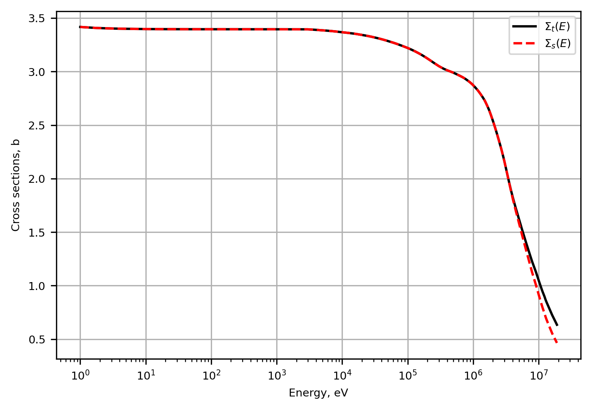
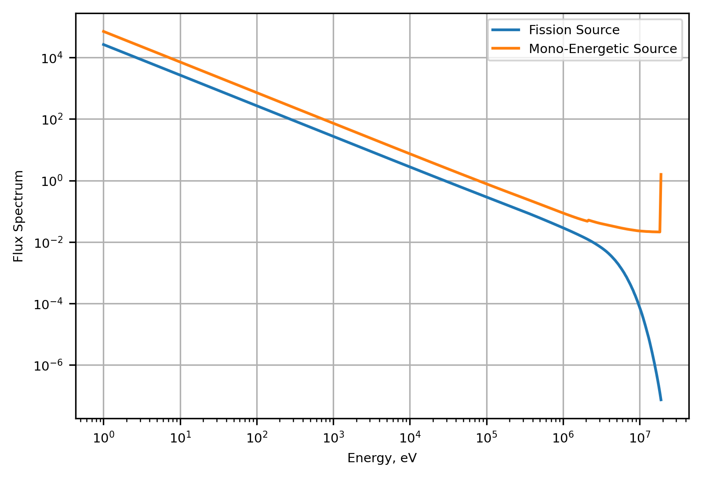
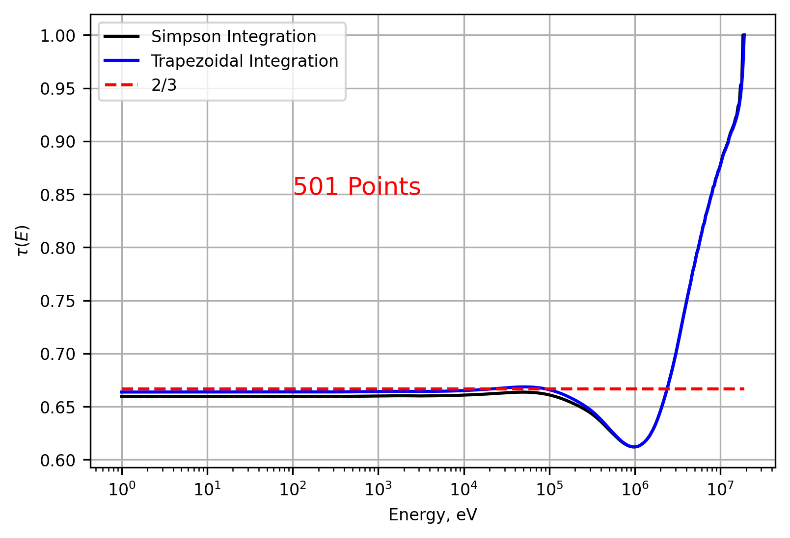

:orphan:

.. _TCRnotebook:

====================================
Transport Correction Ratio Notebook
====================================

Return to :ref:`proj2` documentation.

Transport Correction Ratio

This notebook is used to compare transport correction ratios (TCR) for
H-1 and higher atomic mass isotopes.

.. code:: python

    # import relevant packages
    import matplotlib.pyplot as plt
    import numpy as np
    import pandas as pd
    import time
    plt.rcParams['font.size'] = 16
    plt.rcParams['figure.figsize'] = [6, 4] # Set default figure sizeimport numpy as np

.. code:: python

    # import relevant functions from transportcorrection.py 
    from transportcorrection import energyInterpolation, InfFlux, Plot1d, analyticTCR

Read in cross section data

.. code:: python

    # read in data from desired data file (first we will use H1 data)
    data = pd.read_csv("./database/H2.csv")
    isotopeMass = 2
    isotopeName = "H2"
    energy = np.array(data['energy'])
    sigT = np.array(data['total'])
    sigS = np.array(data['scattering'])

Define the source term

.. code:: python

    # source term definition
    # fission spectrum
    srcFiss = np.exp(-energy/9.880E+05)*np.sinh((2.249E-06*energy)**0.5)
    srcFiss = srcFiss / np.sum(srcFiss)
    # Monoenergetic source
    srcMono = np.zeros_like(energy)
    srcMono[-1] = energy[-1] 
    srcMono = srcMono / np.sum(srcMono)
    

Interpolate the energy and cross section data to improve resolution

.. code:: python

    energyN = 501 # number of energy points 
    lowerE, upperE = 1, 19E+06  #  upper and lower energy limits
    
    # Define interpolated arrays for fission spectrum source and monoenergetic source
    sigS1Fiss, sigT1Fiss, src1Fiss, energy1Fiss =\
        energyInterpolation(energy, sigS, sigT, srcFiss, energyN, lowerE, upperE,'log')
    
    sigS1Mono, sigT1Mono, src1Mono, energy1Mono =\
        energyInterpolation(energy, sigS, sigT, srcMono, energyN, lowerE, upperE,'log')
    

.. code:: python

    plt.figure()
    Plot1d(energy1Fiss, sigT1Fiss, xlabel="Energy, eV", ylabel="total", fontsize=7, marker="-k", markerfill=False, markersize=6, legend="$\Sigma_{t}(E)$")
    Plot1d(energy1Fiss, sigS1Fiss, xlabel="Energy, eV", ylabel="Cross sections, b", fontsize=7, marker="--r", markerfill=False, markersize=6, legend="$\Sigma_{s}(E)$")
    plt.grid()
    

Solve for flux using either an infinite flux formulation or a separate
analytic flux

Infinite flux general form for A :math:`\ge` 1:

.. math::
    
    \begin{equation}
    \Sigma_T(E)\phi(E)=\int_E^{\infty}\frac{\Sigma_s(E')\phi(E')}{(1-\alpha)E'}dE'+S(E)
    \end{equation}

where :math:`\alpha` is:

.. math::
    
    \begin{equation}
    \alpha = \frac{(1-A)^2}{(1+A)^2}
    \end{equation}

.. code:: python

    # choose the infinite flux solution (from fission spectrum source or monoenergetic source)
    flxFiss = InfFlux(energy1Fiss, sigS1Fiss, sigT1Fiss, src1Fiss, isotopeMass)
    flxMono = InfFlux(energy1Mono, sigS1Mono, sigT1Mono, src1Mono, isotopeMass)
    # normalized
    flxNormFiss = flxFiss/np.sum(flxFiss)
    flxNormMono = flxMono/np.sum(flxMono)
    
    # Plots for comparing mono-energetic to fission sources
    plt.figure()
    plt.loglog(energy1Fiss, flxFiss, label='Fission Source')
    plt.loglog(energy1Mono,flxMono, label='Mono-Energetic Source')
    plt.xlabel('Energy, eV'), plt.ylabel('Flux Spectrum'), plt.legend()
    plt.grid()
    

Solve for the TCR using:

.. math::
    
    \begin{equation}
    \tau(E)=\left[ 1+\frac{1}{\phi(E)} \int_E^{E_{max}} dE'\frac{\phi(E')\mu(E' \rightarrow E)}{\tau(E')(1-\alpha)(E')} \right]^{-1}
    \end{equation}

where

.. math::
    
    \begin{equation}
    \mu(E' \rightarrow E)= \frac{1}{2}(A+1)\sqrt{\frac{E}{E'}}-\frac{1}{2}(A-1)\sqrt{\frac{E'}{E}}
    \end{equation}

.. code:: python

    #using simpson method
    start=time.time()
    tauFissSimpson = analyticTCR(energy1Fiss, flxNormFiss, isotopeMass, 'simpson')
    end=time.time()
    print(f"calculation took {end-start:.4f}s")
    
    #using trapezoid method
    start=time.time()
    tauFissTrap = analyticTCR(energy1Fiss, flxNormFiss, isotopeMass, 'trapezoid')
    end=time.time()
    print(f"calculation took {end-start:.4f}s")

.. parsed-literal::

    calculation took 0.0715s
    calculation took 0.0458s
    

.. code:: python

    # find average cosine of the scattering angle and Tau as energy approaches 0
    tau0=(1-2/(3*isotopeMass))*np.ones(flxNormFiss.shape[0])

.. code:: python

    plt.figure()
    Plot1d(energy1Fiss, tauFissSimpson, xlabel="Energy, eV", ylabel="$\\tau(E)$", fontsize=8, marker="-k", markerfill=False, markersize=6, legend='Simpson Integration')
    plt.grid()
    Plot1d(energy1Fiss, tauFissTrap, xlabel="Energy, eV", ylabel="$\\tau(E)$", fontsize=8, marker="-b", markerfill=False, markersize=6, legend='Trapezoidal Integration')
    plt.grid()
    Plot1d(energy1Fiss, tau0, xlabel="Energy, eV", ylabel="$\\tau(E)$", fontsize=8, marker="--r", markerfill=False, markersize=6, legend=f'{isotopeMass}/3')
    plt.text(100, 0.85, "501 Points", fontsize=12, color="r")

.. parsed-literal::

    Text(100, 0.85, '5001 Points')

.. code:: python

    diff = np.abs(tauFissSimpson - tauFissTrap)
    # Find the index of the maximum difference
    max_index = np.argmax(diff)
    max_value = diff[max_index]
    print(f"Max difference: {max_value}")

.. parsed-literal::

    Max difference: [0.02935336]
    
