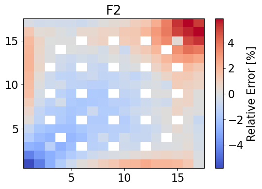

:orphan:

.. _PowerReconstruct:

Flux and Power Reconstruction
=============================

Return to :ref:`proj6` documentation.

The 2D nodal flux solutions are obtained using the analytic function
expansion nodal method. Homogeneous corner-point flux values are found
using a Fischer and Finnemann formulation.

.. code:: python

    from IPython.display import Image
    import matplotlib.pyplot as plt
    from matplotlib import rcParams
    import numpy as np
    FONT_SIZE = 16
    plt.rcParams['figure.figsize'] = [6, 4]
    from analytic_nodal_expansion import AFEN2D, meshPlot, GetSerpentRes
    import serpentTools
    from serpentTools.settings import rc

.. code:: python

    # Import relevant data from the lattice step calculations and NEM solution
    import importnb
    from importnb import imports
    with imports("ipynb"):
        import latticeParameters
    from latticeParameters import cdf455, cdf260, ff455, ff260, surffluxhom

.. code:: python

    # read in data
    detFile = './serpent/SMR/SMR_Ref_2D_2g_det0.m'
    resFile = './serpent/SMR/SMR_Ref_2D_2g_res.m'
    rc["serpentVersion"] = "2.2.1"
    det = serpentTools.read(detFile)
    xsF2, bcF2 = GetSerpentRes(resFile, 'F2', 0)
    xsF11, bcF11 = GetSerpentRes(resFile, 'F11', 0)
    xsF12, bcF12 = GetSerpentRes(resFile, 'F12', 0)
    xsRef, bcRef = GetSerpentRes(resFile, 'Ref', 0)
    
    bc = {'F2': bcF2, 'F11': bcF11, 'F12': bcF12, 'Ref': bcRef}
    xs = {'F2': xsF2, 'F11': xsF11, 'F12': xsF12, 'Ref': xsRef}
    
    npins = 17
    dx, dy = 21.42, 21.42

Build out the heterogeneous flux boundary condition dictionary

.. code:: python

    bcflux = {}
    for univ in bc: # defining BC for each universe
        bcflux[univ] = {}
        # store the heterogeneous surface and corner fluxes
        bcflux[univ]['av'] = bc[univ]['flux']
    
        bcflux[univ]['w'] = bc[univ]['wFlux']
        bcflux[univ]['e'] = bc[univ]['eFlux']
        bcflux[univ]['s'] = bc[univ]['sFlux']
        bcflux[univ]['n'] = bc[univ]['nFlux']
    
        bcflux[univ]['nw'] = bcflux[univ]['n']+bcflux[univ]['w']-bcflux[univ]['av']
        bcflux[univ]['ne'] = bcflux[univ]['n']+bcflux[univ]['e']-bcflux[univ]['av']
        bcflux[univ]['sw'] = bcflux[univ]['s']+bcflux[univ]['w']-bcflux[univ]['av']
        bcflux[univ]['se'] = bcflux[univ]['s']+bcflux[univ]['e']-bcflux[univ]['av']

Calculate the homogeneous corner-point fluxes using the heterogeneous
surfaces fluxes and assembly CDFs

.. code:: python

    # Build homogeneous flux bc dictionary
    bcfluxhom = {}
    for univ in bc:
        bcfluxhom[univ] = {}
        bcfluxhom[univ]['av'] = bc[univ]['flux']
    
        # Assign homogeneous surface fluxes from NEM solution
        bcfluxhom[univ]['w'] = surffluxhom[univ]['w']
        bcfluxhom[univ]['e'] = surffluxhom[univ]['e']
        bcfluxhom[univ]['s'] = surffluxhom[univ]['s']
        bcfluxhom[univ]['n'] = surffluxhom[univ]['n']
    
        # Heterogeneous surface flux BCs
        # bcfluxhom[univ]['w'] = bc[univ]['wFlux']
        # bcfluxhom[univ]['e'] = bc[univ]['eFlux']
        # bcfluxhom[univ]['s'] = bc[univ]['sFlux']
        # bcfluxhom[univ]['n'] = bc[univ]['nFlux']
        
    
    # Calculate homogeneous cornerpoint fluxes
    # F12
    bcfluxhom['F12']['ne'] = (bcflux['F12']['ne'] + bcflux['Ref']['nw'])/(2*cdf260)
    bcfluxhom['F12']['nw'] = (bcflux['F12']['nw'])/(cdf260)
    bcfluxhom['F12']['sw'] = (bcflux['F12']['sw'] + bcflux['F2']['nw'])/(2*cdf260)
    bcfluxhom['F12']['se'] = (bcflux['F12']['se'] + bcflux['Ref']['sw']+
                           bcflux['F2']['ne'] + bcflux['F11']['nw'])/(4*cdf260)
    
    # F2
    bcfluxhom['F2']['ne'] = (bcflux['F12']['se'] + bcflux['Ref']['sw']+
                           bcflux['F2']['ne'] + bcflux['F11']['nw'])/(4*cdf455)
    bcfluxhom['F2']['nw'] = (bcflux['F12']['sw'] + bcflux['F2']['nw'])/(2*cdf455)
    bcfluxhom['F2']['sw'] = (bcflux['F2']['sw'])/(cdf455)
    bcfluxhom['F2']['se'] = (bcflux['F2']['se'] + bcflux['F11']['sw'])/(2*cdf455)
    
    # F11
    bcfluxhom['F11']['ne'] = (bcflux['F11']['ne'] + bcflux['Ref']['se'])/(2*cdf260)
    bcfluxhom['F11']['nw'] = (bcflux['F12']['se'] + bcflux['Ref']['sw']+
                           bcflux['F2']['ne'] + bcflux['F11']['nw'])/(4*cdf260)
    bcfluxhom['F11']['sw'] = (bcflux['F2']['se'] + bcflux['F11']['sw'])/(2*cdf260)
    bcfluxhom['F11']['se'] = (bcflux['F11']['se'])/(cdf260)

Develop flux solutions for fuel assemblies using specified assembly and
AFEN method

.. code:: python

    xvals = np.linspace(-dx/2, +dx/2, npins+1)
    xvals = 0.5*(xvals[1:]+xvals[0:-1])
    yvals = xvals
    universes = ['F2', 'F12', 'F11']
    homogeneousFlux = {}
    pinPower = {}
    for idx, univId in enumerate(universes):
        homogeneousFlux[univId] = {}
        univres = AFEN2D(xs[univId], bcfluxhom[univId], dx, symbolic=False)
        univres.ReconstructFlux()
        univres.GetFlux2D(xvals, yvals)
        homogeneousFlux[univId] = univres.flux2d
    
        # Compute power
        if univId == 'F2':
            pinPower[univId] = univres.ReconstructPower(homogeneousFlux[univId], ff455)
        elif univId in ['F11', 'F12']:
            pinPower[univId] = univres.ReconstructPower(homogeneousFlux[univId], ff260)

Generate data for reference solution power distribution

.. code:: python

    # F2
    fastHetFluxF2 = det.detectors['flux_fast'].tallies[0:npins, 0:npins]
    thermalHetFluxF2 = det.detectors['flux_thermal'].tallies[0:npins, 0:npins]
    fastPowerF2 = det.detectors['power_fast'].tallies[0:npins, 0:npins]
    thermalPowerF2 = det.detectors['power_thermal'].tallies[0:npins, 0:npins]
    totalPowerF2 = fastPowerF2 + thermalPowerF2
    # F11
    fastHetFluxF11 = det.detectors['flux_fast'].tallies[0:npins, npins:]
    thermalHetFluxF11 = det.detectors['flux_thermal'].tallies[0:npins, npins:]
    fastPowerF11 = det.detectors['power_fast'].tallies[0:npins, npins:]
    thermalPowerF11 = det.detectors['power_thermal'].tallies[0:npins, npins:]
    totalPowerF11 = fastPowerF11 + thermalPowerF11
    # F12
    fastHetFluxF12 = det.detectors['flux_fast'].tallies[npins:, 0:npins]
    thermalHetFluxF12 = det.detectors['flux_thermal'].tallies[npins:, 0:npins]
    fastPowerF12 = det.detectors['power_fast'].tallies[npins:, 0:npins]
    thermalPowerF12 = det.detectors['power_thermal'].tallies[npins:, 0:npins]
    totalPowerF12 = fastPowerF12 + thermalPowerF12

Plot power distributions for reference and reconstructed

.. code:: python

    meshPlot(totalPowerF2, npins, universes[0], 'power')
    meshPlot(pinPower['F2'], npins, universes[0], 'power')
    
    meshPlot(totalPowerF12, npins, universes[1], 'power')
    meshPlot(pinPower['F12'], npins, universes[1], 'power')
    
    meshPlot(totalPowerF11, npins, universes[2], 'power')
    meshPlot(pinPower['F11'], npins, universes[2], 'power')

.. image:: powerReconstruct_files/powerReconstruct_14_1.png

.. image:: powerReconstruct_files/powerReconstruct_14_2.png

Build relative error plots

.. code:: python

    totalPowerF2 = np.where(totalPowerF2 == 0, np.nan, totalPowerF2)
    errorF2 = 100*(totalPowerF2-pinPower['F2'])/(totalPowerF2)
    
    totalPowerF12 = np.where(totalPowerF12 == 0, np.nan, totalPowerF12)
    errorF12 = 100*(totalPowerF12-pinPower['F12'])/(totalPowerF12)
    
    totalPowerF11 = np.where(totalPowerF11 == 0, np.nan, totalPowerF11)
    errorF11 = 100*(totalPowerF11-pinPower['F11'])/(totalPowerF11)
    
    meshPlot(errorF2, npins, 'F2', 'relative error', cmap='coolwarm')
    meshPlot(errorF12, npins, 'F12', 'relative error', cmap='coolwarm')
    meshPlot(errorF11, npins, 'F11', 'relative error', cmap='coolwarm')

.. code:: python

    errorF2 = np.nan_to_num(errorF2)
    maxErrorF2 = np.max(errorF2)
    averageAbsErrorF2 = np.average(np.abs(errorF2))
    print(f"The maximum error is {maxErrorF2}% and the mean absolute error is {averageAbsErrorF2}%.")

.. parsed-literal::

    The maximum error is 5.867936391468032% and the mean absolute error is 1.1390347278271205%.
    

.. code:: python

    errorF12 = np.nan_to_num(errorF12)
    maxErrorF12 = np.max(errorF12)
    averageAbsErrorF12 = np.average(np.abs(errorF12))
    print(f"The maximum error is {maxErrorF12}% and the mean absolute error is {averageAbsErrorF12}%.")

.. parsed-literal::

    The maximum error is 14.16044533652908% and the mean absolute error is 2.6383209518641477%.
    

.. code:: python

    errorF11 = np.nan_to_num(errorF11)
    maxErrorF11 = np.max(errorF11)
    averageAbsErrorF11 = np.average(np.abs(errorF11))
    print(f"The maximum error is {maxErrorF11}% and the mean absolute error is {averageAbsErrorF11}%.")

.. parsed-literal::

    The maximum error is 14.18504491205774% and the mean absolute error is 2.632173609101986%.
    
