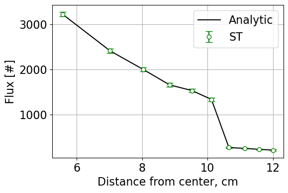

.. _proj1:

Weighted Delta Tracking
---------------------------------- 

=====================
Introduction
=====================

Weighted delta tracking is implemented for Monte Carlo simulations of neutron transport as a nonanalog method. The technique uses formalisms developed in Woodcock delta tracking but removes probability sampling for real or virtual collisions. This technique also uses implicit capture to adjust neutron weight during its random walk. Using weighted delta tracking with Russian Roulette, the algorithm performance is compared against surface tracking and standard delta tracking with an analytical solution for reference.

The weighted delta tracking algorithm and associated data processing is completed using ``pointsource_sphere.py`` which contains the class ``PointSourceInSphere``. The functions contained within ``PointSourceInSphere`` include an analytic solver, a solver for surface tracking (ST), a solver for delta tracking (DT), a solver for weighted delta tracking (WDT), and associated post processing functions such as statistical analysis and plotting.

The Monte Carlo simulation is initialized within the class using:

.. code::

	def __init__(self, nMC, S0, R, sigT):

``nMC`` represents the number of Monte Carlo simulations, ``S0`` is the source strength, ``R`` is the radius of the outermost sphere in a series of concentric spherical shells, and ``sigT`` is an array containing total cross sections for each region.

All solutions are developed in a Jupyter Notebook, a sample of which can be found here.

:ref:`montecarlojupyternotebook`

======================
Methodology
======================

The general approach to implementing a WDT solver with Russian Roulette is:

	1. Sample neutron position following streaming.
	2. Calculate neutron weight to be tallied for regions crossed from previous location to current.
	3. Reduce neutron weight following the "collision." (Representing a portion of the neutron absorbed, the remainder to continue its random walk.)
	4. Check neutron weight against a threshold weight, if above the threshold repeat steps 1:4. If below the threshold, complete step 5.
	5. Play Russian Roulette for survival and restore weight upon survival or terminate the neutron.

This project uses the majorant cross section, defined as :math:`\Sigma_{maj} = max(\Sigma_{t,i})`, where *i* is over all regions. From this definition a pathlength is determined using
	.. math::
		S = \frac{-ln(\xi)}{\Sigma_{maj}}

:math:`\xi` is a random number drawn from a uniform distribution between 0 and 1. Assuming a point source, all neutrons are born at the origin (0,0,0). 

.. Note::

	* Neutron directional quantities are sampled using the following:

	.. math::

		\theta = \arccos(1 - 2\xi_{1})
		
		\phi = 2\pi\xi_{2}

The weight tallied for all regions crossed is given by :math:`w_{i-1}(\frac{\Sigma_{t,i}}{\Sigma_{maj}})` and the reduction in neutron weight is calculated using :math:`w_{i}=w_{i-1}(1-\frac{\Sigma_{t,i}}{\Sigma_{maj}})`. This value is then tested against the weight threshold:

.. code::

	if weight < weight_threshold: 
		survival_prob = weight/weight_0 
		if np.random.rand() < survival_prob: 
			weight = weight_0 
		else: 
			break

If the ``break`` is encountered, the neutron is terminated. Otherwise, the neutron continues its random walk with its weight restored. At this point the position and region index are updated.

.. code::

 x0, y0, z0 = x1, y1, z1
 idx_prev = idx_curr 

==========================
Results
==========================

--------------
Case 1
--------------
Three cases were tested. The first test considered ten regions with macroscopic cross sections bounded between 0.1 and 0.25 cm :math:`^{-1}` and randomly generated using:

.. code:: python

	xs = np.random.uniform(low = 0.1, high = 0.25, size = (10))

Using the ST, DT, and WDT routines, the following flux results were obtained. The cross sections are given by the histogram below. The flux tally in each of the ten regions is overlaid on the analytic flux for the given cross sections. The case that generated these plots was 100 simulations at 10000 neutrons with a outer radius of 12 cm :math:`^{-1}`.

--------------
Case 2
--------------
The second case defined :math:`\Sigma_{t}` in the seventh region as 3 cm :math:`^{-1}`. All other cross sections were randomly generated as in case 1. The same simulation parameters were chosen. The resulting flux plots were generated based on the cross sections:

--------------
Case 3
--------------
The third case returned cross sections to being uniformly distributed between 0.1 and 0.25 cm :math:`^{-1}`. However, this case used 30 regions. Again the same simulation parameters were used. The resulting flux plots were obtained with the cross sections shown below.

.. image:: images/monte_carlo_results/case3histogram.png
  :width: 600
  :align: center

.. image:: images/monte_carlo_results/case3STflux.png
  :width: 600
  :align: center

.. image:: images/monte_carlo_results/case3DTflux.png
  :width: 600
  :align: center

.. image:: images/monte_carlo_results/case3WDTflux.png
  :width: 600
  :align: center

.. image:: images/monte_carlo_results/case3diff.png
  :width: 600
  :align: center

The tables below give relevant data in terms of leakage, runtimes, flux standard deviations, and figures of merit (FoM) for each case and each routine tested. The FoM is calculated as:

.. math::

	FoM = \frac{1}{T_{run}\sigma_{flux}^{2}}

*Case 1 Summary Results*

============= =============================== ================ ====================== =========================
Method            :math:`\Delta` Leakage [%]     Runtime [s]    :math:`\sigma_{flux}`       FoM
============= =============================== ================ ====================== =========================
ST                       0.01                    25.11                50.92                  1.54E-5
------------- ------------------------------- ---------------- ---------------------- -------------------------
DT                        0.04                    25.16                50.60                 1.55E-5
------------- ------------------------------- ---------------- ---------------------- -------------------------
WDT                        0.02                    29.85                45.29                1.63E-5
============= =============================== ================ ====================== =========================

*Case 2 Summary Results*

============= =============================== ================ ====================== =========================
Method            :math:`\Delta` Leakage [%]     Runtime [s]    :math:`\sigma_{flux}`       FoM
============= =============================== ================ ====================== =========================
ST                       0.00                    21.40                53.46                  1.84E-5
------------- ------------------------------- ---------------- ---------------------- -------------------------
DT                        0.01                    90.72                47.23                 4.94E-6
------------- ------------------------------- ---------------- ---------------------- -------------------------
WDT                        0.00                    190.54                38.76                3.49E-6
============= =============================== ================ ====================== =========================

*Case 3 Summary Results*

============= =============================== ================ ====================== =========================
Method            :math:`\Delta` Leakage [%]     Runtime [s]    :math:`\sigma_{flux}`       FoM
============= =============================== ================ ====================== =========================
ST                       0.01                    37.95                48.33                  1.13E-5
------------- ------------------------------- ---------------- ---------------------- -------------------------
DT                        0.01                    19.84                42.80                 2.75E-5
------------- ------------------------------- ---------------- ---------------------- -------------------------
WDT                        0.02                    23.99                50.94                1.61E-5
============= =============================== ================ ====================== =========================

===========
Conclusions
===========

In summary, surface tracking, standard delta tracking, and weighted delta tracking were analyzed against analytic solutions to neutron transport through concentric spherical shells with heterogenous macroscopic cross sections.
By varying the number of shells and the macroscopic cross sections, the differences between solution methods were identified.
Delta tracking and weighted delta tracking were penalized in case 2 due to the insertion of a large macroscopic cross section.
Surface tracking was penalized when the number of regions, therefore surfaces, was increased. From these results, the times in which one uses different algorithms is dependent on the physical system modeled.
Overall, all algorithms were in good agreement with the analytic solutions. It is interesting to see the performance differences in the presented algorithms and the different use-cases for each.

Return to the top of the page: :ref:`proj1`

