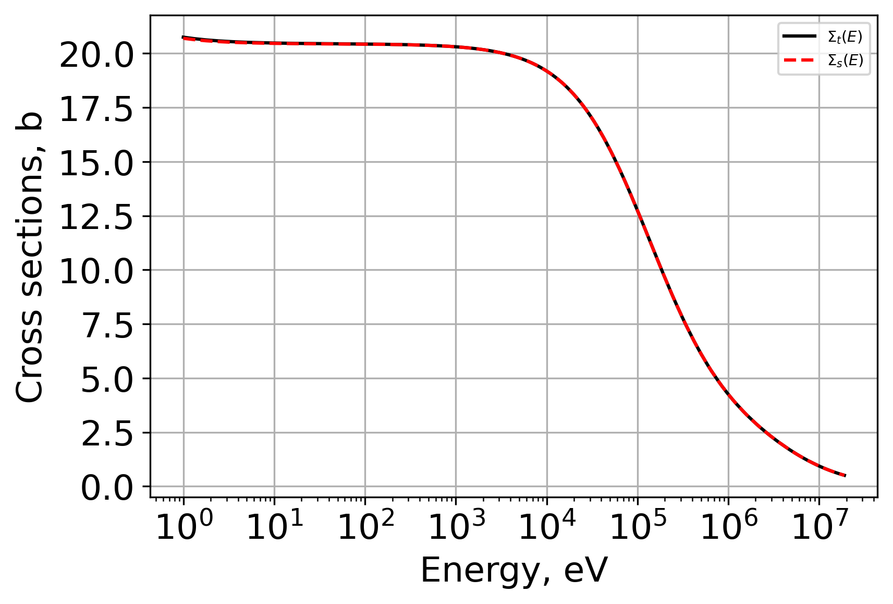
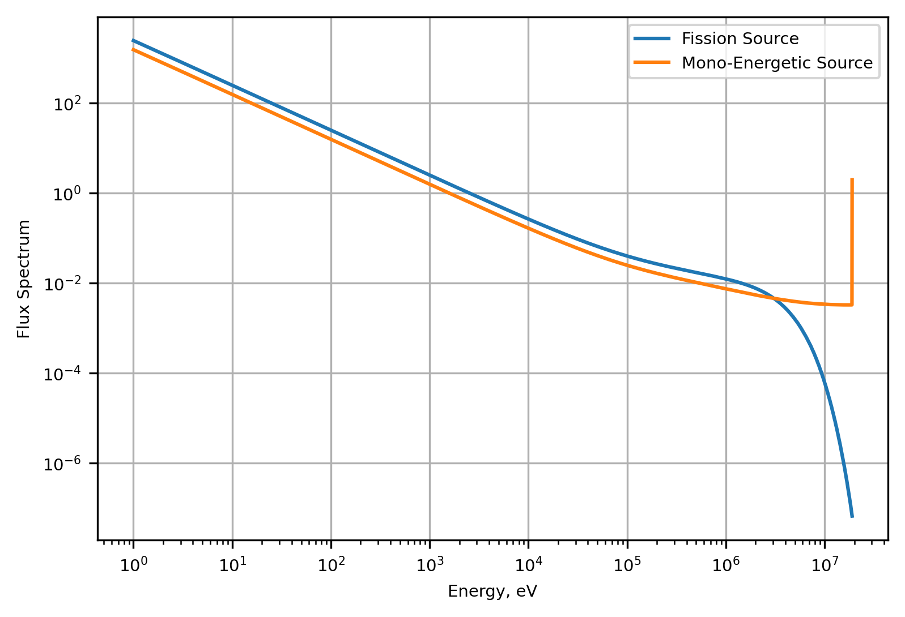
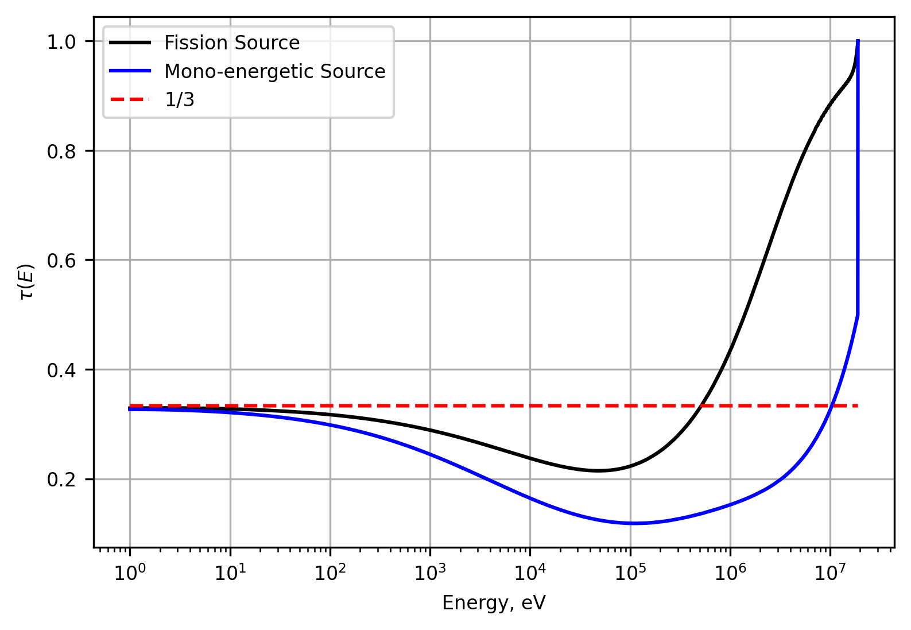
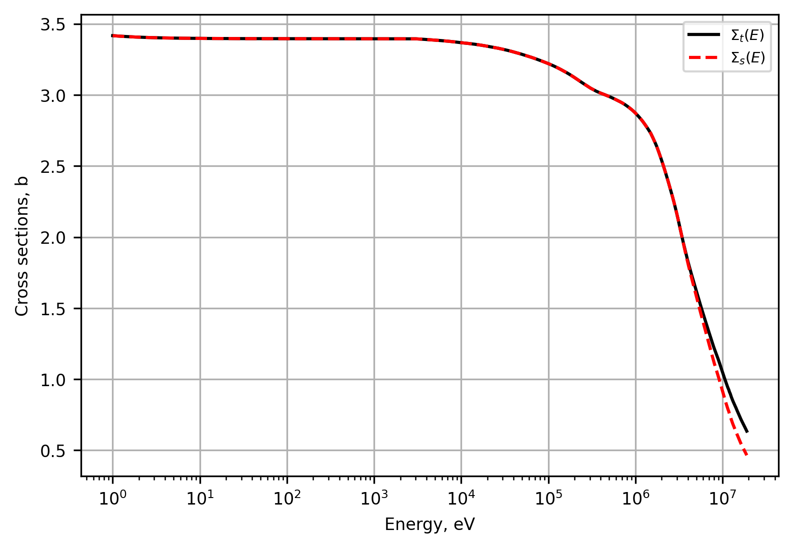
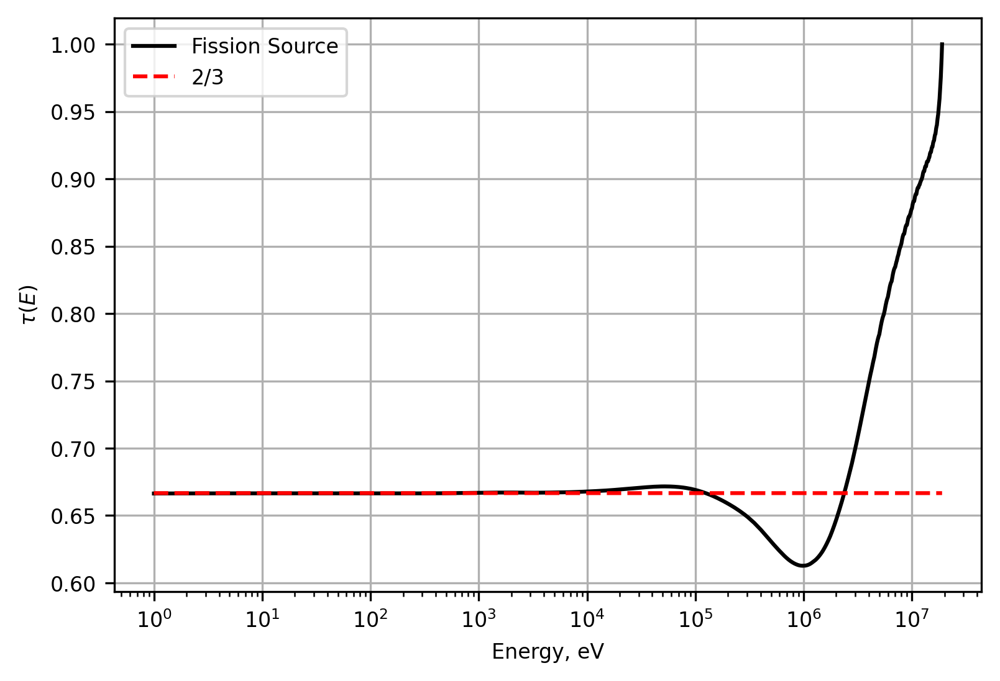

.. _proj2:

Project 2: Transport Correction Ratio
-------------------------------------

=====================
Introduction
=====================

A transport correction ratio allows for one to determine the transport cross section :math:`\Sigma_{tr}(\mathbf{r},E)` as a function of the correction ratio, :math:`\tau(\mathbf{r},E)` and the total macroscopic cross section, :math:`\Sigma_{t}(\mathbf{r},E)`.  

The transport correction ratio (TCR) is given by 

.. math::

    \tau(E)=\frac{\Sigma_{tr}(E)}{\Sigma_{t}(E)}=\left[ 1+\frac{1}{\phi(E)} \int_E^{E_{max}} dE'\frac{\phi(E')\mu(E' \rightarrow E)}{\tau(E')(1-\alpha)(E')} \right]^{-1}

where the differential scattering angle is given by

.. math::

    \mu(E' \rightarrow E)= \frac{1}{2}(A+1)\sqrt{\frac{E}{E'}}-\frac{1}{2}(A-1)\sqrt{\frac{E'}{E}}

and :math:`\alpha` is

.. math::

    \alpha = \frac{(1-A)^2}{(1+A)^2}

This formulation assumes an infinite homogeneous medium were neutron absorption is neglected. To solve this set of equations, one must first calculate the infinite flux spectrum given energy dependent cross section data and a known source. 

Using slowing down theory, the neutron flux spectrum can be derived from

.. math::

    \Sigma_T(E)\phi(E)=\int_E^{\frac{E}{\alpha}}\frac{\Sigma_s(E')\phi(E')}{(1-\alpha)E'}dE'+S(E)

The objective is to calculate various flux spectrum and TCR and observe the differing results based on the source used, the isotope considered, and numerical methods employed.

For reference, a sample of work completed using the functions described below is contained in the Jupyter Notebook:

:ref:``

=====================
Methodology
=====================

The python script ``transportcorrection.py`` was modified to accomplish the following goals:

	1. Perform a comparison of TCRs developed for H-1 energy dependent cross sections using both a fission spectrum source and a mono-energetic source.
	2. Investigate the TCR for H-2 given a fission spectrum source.
	3. Change numerical integration schemes and identify performance differences.

-------------------
Source Comparisons
-------------------

To accomodate for the mono-energetic source, changes were made to the ``energyInterpolation`` function. A check was implemented to identify the user defined mono-energetic source and then the non-zero energy index was placed in the nearest fine energy structure bin. A sample of the function change is provided.

.. code:: python

    # Check if src is mono-energetic
    nonzero_indices = np.nonzero(src)[0] 
    if len(nonzero_indices) == 1: 
        idx = nonzero_indices[0] # get index of the source
        mono_energy = energy[idx] 
        mono_value = src[idx] 
    
        # Initialize new source as zeros 
        src1 = np.zeros_like(energy_new) 
    
        # Find closest index in energy_new to mono_energy 
        closest_idx = np.abs(energy_new - mono_energy).argmin() 
    
        # Assign mono_value to closest bin
        src1[closest_idx] = mono_value 

The mono-energetic source tested was set at :math:`E_{max}` to correspond to the maximum energy used in the fine energy structure. With this mono-energetic source, the fission spectrum source, and H-1 cross section data, the infinite flux spectrums and the TCRs were developed.

-------------------------
Isotope Mass A>1 (H-2)
-------------------------

When H-1 is used for flux calculations, the term :math:`\alpha` is zero. This simplified the expressions for infinite flux and TCR. However, for isotopes with mass A>1, we must retain :math:`\alpha`.
Furthermore, the amount of energy a neutron loses in an elastic collision with isotopes other than H-1 is limited by :math:`\alpha E'`. Therefore, a maximum neutron energy that is capable of down-scattering into the energy of concern was defined.
This was accomplished by modifying the function ``InfFlux`` to receive the isotope mass, A, as an argument. After checking A>1, a maximum energy capable of contributing to the flux in each energy *i* (signified by rows) is found which then limits the *j* energies (columns) to iterate over. 
The logig begins with determining the maximum energy for each row *i* and then finding the applicable columns *j* that can contribute to the infinite flux.

.. code:: python

    E_max = energy[i] / alpha # maximum energy to downscatter from contributing to row i 

    # Find indices j >= i (not considering upscatter) where energy[j] <= E_max
    downscatter_indices = np.where(energy[i:] <= E_max)[0]  
    
    j_end = i + downscatter_indices[-1]  # index of highest energy j 
    
    # Define slice of contributing energy range 
    E_slice = energy[i:j_end + 1] 
    sigS_slice = sigS[i:j_end + 1] 
    dE = np.diff(E_slice) 
    n_intervals = len(dE)

=================
Results
=================

----------------------
Mono-energetic Source
----------------------

-----------
H-2 TCR
-----------

Return to the top of the page: :ref:`proj2`
