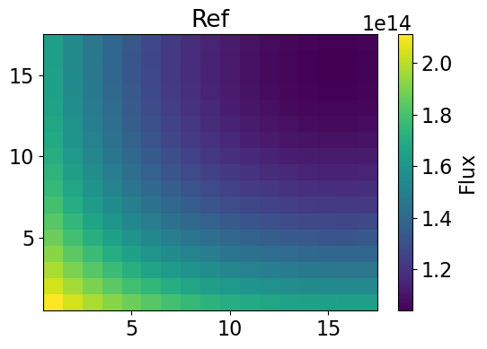
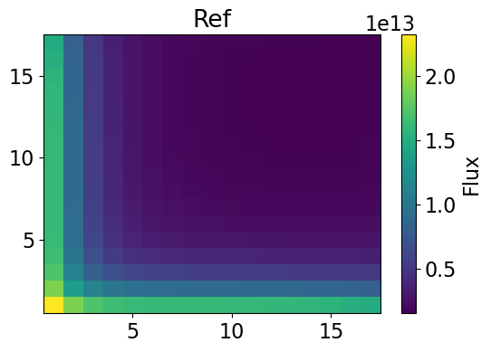
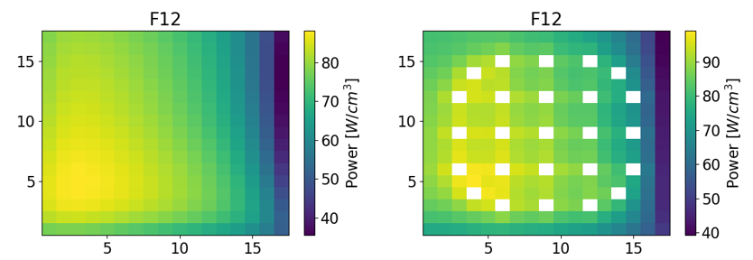
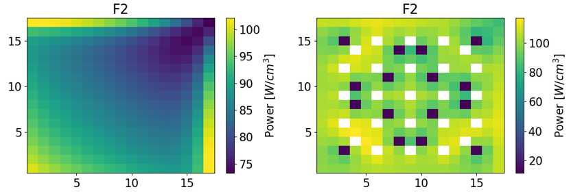
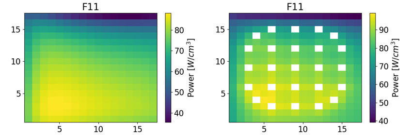
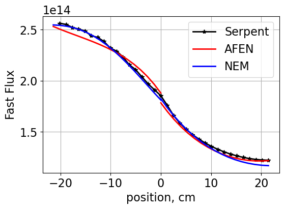
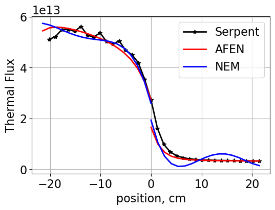
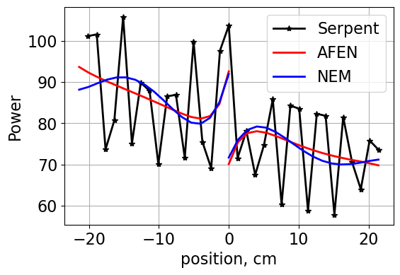

.. _proj5:

Analytic Function Expansion Nodal Method
---------------------------------------------

.. _IntroductionAFEN:

=====================
Introduction
=====================

In the project addressing :ref:`proj4`, one-dimensional homogenized flux profiles were generated for a 2x2 colorset using NEM and transverse leakages. By implementing transverse leakages, the dimensionality of the 2D case was reduced to 1D.
This method conveniently provided homogenized flux values for the node surfaces and average nodal flux. However, the usage of NEM with transverse leakages precludes the pin-power reconstruction. To accomplish pin-power reconstruction from the homogeneous solution, a multidimensional homogeneous flux distribution must be known.
In this project, the multidimensional (2D) flux distribution is obtained using the analytic function expansion nodal (AFEN) method. This method does not assume spatial separability for the homogenized flux, but instead directly solves the 2D diffusion equations in 2 groups.
2D homogenized flux distributions are calculated for each assembly in the 2x2 colorset represented below.

.. figure:: NEM_DF_files/NEM_DF_6_0.png
  :width: 600
  :align: center

  SMR colorset.

The above assemblies are: Upper left **F12** - 2.6% :math:`UO_2` - Upper right **Ref** - stainless steel - Bottom left **F2** - 4.55% :math:`UO_2` with 8% :math:`Gd_2` :math:`O_3` - Bottom right **F11** - 2.6% :math:`UO_2`. 
The governing equations solved are the 2-group diffusion equations given by:

.. math::

  \begin{gather}
  {{-D_{1}\nabla^{2}\phi_{1}(x,y)+\Sigma_{r1}\phi_{1}(x,y)={\frac{\nu\Sigma_{f1}\phi_{1}(x,y)+\nu\Sigma_{f2}\phi_{2}(x,y)}{k_{eff}}}+\Sigma_{21}\phi_{2}(x,y)}} \\ 
  {{-D_{2}\nabla^{2}\phi_{2}(x,y)+\Sigma_{r2}\phi_{2}(x,y)=\Sigma_{12}\phi_{1}(x,y)}}
  \end{gather}

This set of equations is written in matrix vector notation as:

.. math::

  \begin{gather}
  \left({\frac{\partial^{2}}{\partial x^{2}}}+{\frac{\partial^{2}}{\partial y^{2}}}\right)\underline{\phi}(x,y)-{\underline{\underline{{D}}}}^{-1}\left(\underline{\underline{{{\Sigma}}}}-{\frac{1}{k_{e f f}}}{\underline{\underline{{{F}}}}}\right)\;\underline{\phi}(x,y)=\underline{0} \\
  \underline{\underline{{{D}}}}=\left[\begin{array}{c c}{{D_{1}}}&{{0}}\\ {{0}}&{{D_{2}}}\end{array}\right] \\
  \underline{\underline{\Sigma}}=\left[\begin{array}{c c}{{\Sigma_{r1}}}&{{-\Sigma_{21}}}\\ {{-\Sigma_{12}}}&{{\ \Sigma_{r2}}}\end{array}\right] \\
  \underline{\underline{F}}=\left[\begin{array}{c c}{{\nu\Sigma_{f1}}}&{{\nu\Sigma_{f2}}}\\ {{0}}&{{0}}\end{array}\right] \\
  \underline{\phi}(x,y) = \begin{bmatrix}\phi_{1}(x,y) \\ \phi_{2}(x,y) \\ \end{bmatrix}
  \end{gather}

If the eigenvalues and right eigenvectors of the expression :math:`{\underline{\underline{{D}}}}^{-1}\left(\underline{\underline{{{\Sigma}}}}-{\frac{1}{k_{e f f}}}{\underline{\underline{{{F}}}}}\right)` are determined as :math:`\lambda_{g}` and :math:`\underline{\underline{R}}` , then the following expressions are defined:

.. math::

  \begin{gather}
  {\nabla}^{2}\xi_{g}(x,y)-{\lambda}_{g}\xi_{g}(x,y)=0 , g=1,2 \\
  \underline{\xi}(x,y)=\underline{\underline{{R}}}^{-1}\;\underline{{{\phi}}}(x,y)
  \end{gather}

Using the newly defined variable, a general solution comprised of an infinite series of hyperbolic functions and periodic functions is obtained using:

.. math::

  \xi_{g}(x,y)=\sum_{i=0}^{\infty}\left[A_{g i}^{\prime}S N\left(k_{g}\left[\alpha_{g x i}x+\alpha_{g y i}y\right]\right)+B_{g i}^{\prime}C S\left(k_{g}\left[\alpha_{g x i}x+\alpha_{g y i}y\right]\right)\right]

Boundary conditions are given by the four surface fluxes defined at each node's four faces along with the four cornerpoint fluxes. Further discussion for using the AFEN method is provided by Jae Man Noh & Nam Zin Cho (1994).
However, the general process solves for the unknown coefficients and then uses the variable definition of :math:`\underline{\xi}` to reconstruct the homogeneous flux as:

.. math::

  \underline{\phi}(x,y)=\underline{\underline{{R}}}\;\underline{{{\xi}}}(x,y)  

The Jupyter Notebook containing work completed for calculating the analytic function expansion nodal method homogenized flux distributions is provided below for reference:

:ref:`AFENnotebook`

=====================
Methodology
=====================

Results are read in from Serpent using ``serpentTools``. Using the theory described in the :ref:`IntroductionAFEN`, the class ``AFEN2D`` is developed. When initializing the class, required arguments include ``xs``, ``bc``, ``dx``, and ``symbolic``. ``xs`` and ``bc`` contain the 2-group homogenized cross section data and the flux boundary conditions for the specified universe.
``symbolic`` is a Boolean which is set to ``True`` if symbolic solving is desired using ``Sympy``. If set to ``False``, the code instead completes all calculations using manually evaluated basis functions and their integrals, thereby improving efficiency.
Several other functions are defined within ``AFEN2D`` such as ``Eigenvalues``, ``ReconstructFlux``, and ``GetFlux2D``. These functions are called from ``analytic_nodal_expansion.py``. A second script is called from ``NEM.py`` to facilitate NEM calculated 1D flux profiles for later comparison.
 
=================
Results
=================

Groupwise flux distributions are generated for each node within the SMR colorset initially described for the problem. Although distributions for all nodes are calculated, only F2 and Ref are presented here. Fast and thermal flux distributions are presented for assemblies F2 and Ref. Within ``analytic_nodal_expansion.py``, the class ``AFEN2D`` contains a function called ``HomogeneousPower``. This function produces the homogeneous group power distributions but does not use form functions. Therefore, the homogeneous power distributions do not capture large power gradients.
Finally, 1D x-dependent y-average nodal fluxes are compared from the AFEN method solution and a NEM solution against the heterogeneous Serpent output.

---------------------------------------------------------
Homogeneous Flux Distributions
---------------------------------------------------------

The fast and thermal flux distributions are plotted for assemblies F2 and Ref using the AFEN method solution.

.. figure:: afen_results/F2_fastflux_manual.png
  :width: 600
  :align: center

  Fast flux distribution for SMR assembly F2 using AFEN method.

.. figure:: afen_results/F2_thermalflux_manual.png
  :width: 600
  :align: center

  Thermal flux distribution for SMR assembly F2 using AFEN method.

  Fast flux distribution for SMR assembly Ref using AFEN method.

  Thermal flux distribution for SMR assembly Ref using AFEN method.

--------------------------
Power Distributions
--------------------------

The thermal power distributions are plotted using both the homogenized flux from the AFEN method solution and from the Serpent reported thermal power. Results for the fuel containing assemblies are shown below. 

  AFEN (left) and Serpent (right) thermal power for assembly F12.

  AFEN (left) and Serpent (right) thermal power for assembly F2.

  AFEN (left) and Serpent (right) thermal power for assembly F11.

The largest thermal power discrepancies are found in assembly F2. Assembly F2 contains burnable absorbers which locally produce large changes in thermal power output. F12 and F11 AFEN calculated power distributions provide better agreement with the Serpent heterogenous power.

-------------------------------------
One Dimensional Comparisons
-------------------------------------

The 2D distributions calculated using AFEN are reduced to a 1D profile by averaging in the *y*-direction. This result is compared against 1D NEM solutions for the same row of assemblies.
The fast flux and thermal flux profiles are compared for assemblies F12 and Ref. Finally, a power profile is compared for assemblies F2 and F11.

  Assemblies F12/Ref fast flux profile.

  Assemblies F12/Ref thermal flux profile.

  Assemblies F2/F11 thermal power profile.

=================
Conclusions
=================

The AFEN method provides a means to calculate the homogeneous power distribution through its ability to solve the mutidimensional diffusion equation. However, relatively high errors are seen in the power reconstruction when compared to the Serpent results.
Without the use of form factors, the pin power reconstruction inadequately models the underlying heterogeneous assembly composition. This will be an area of improvement for the next project.

Return to the top of the page: :ref:`proj5`
