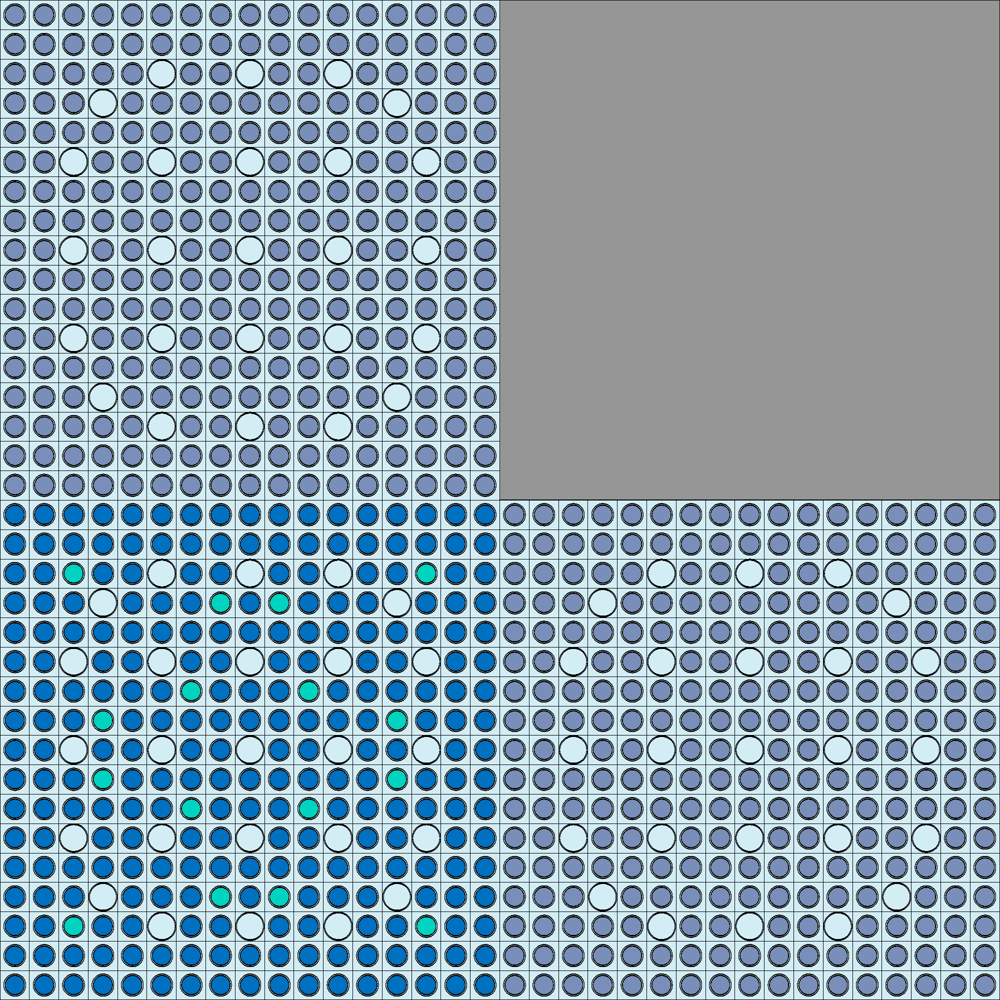
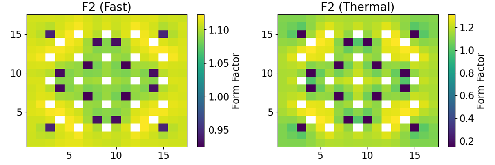
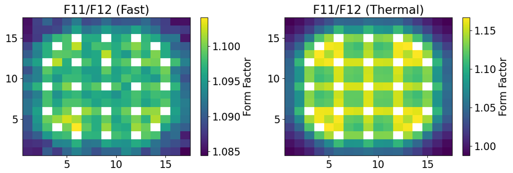
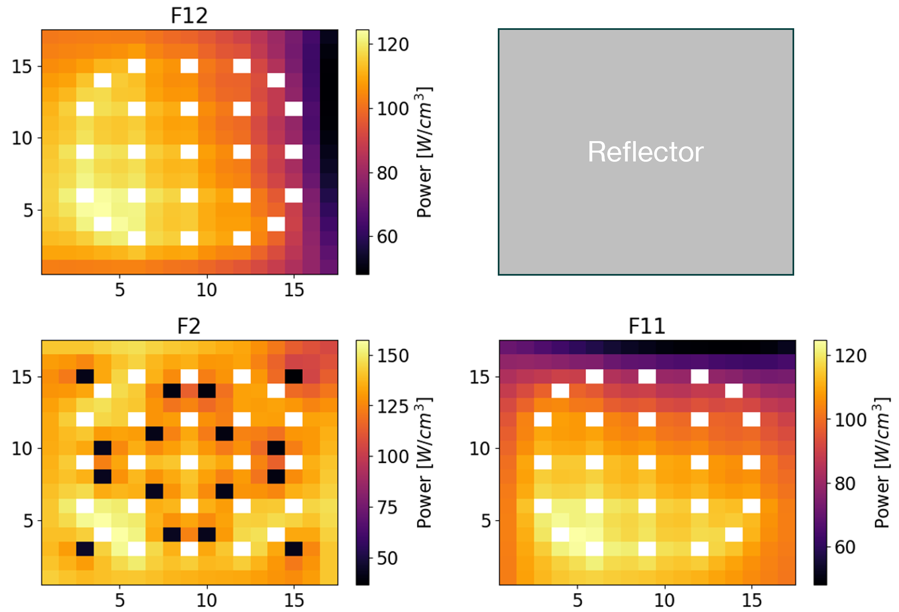
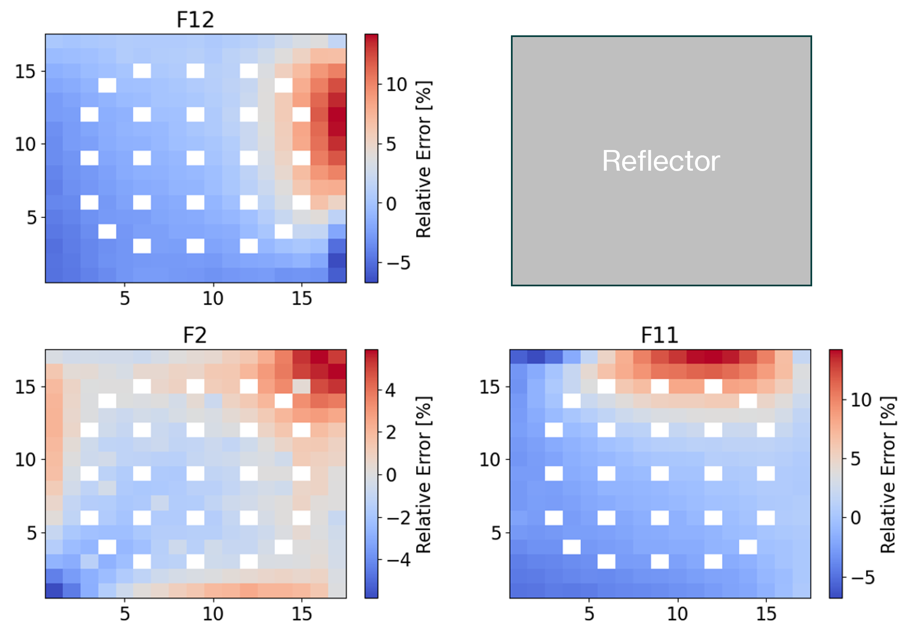

.. _proj6:

Two-Step Approach
--------------------

.. _Introductiontwostep:

=====================
Introduction
=====================

Combining all aspects of the previous projects, this project seeks to transition from lattice calculations to power reconstruction using homogeneous nodal solutions.
Again, considering the 2x2 SMR colorset, a set of Serpent MC runs are performed to develop individual infinite lattice data sets for the unique fuel assemblies.

  SMR colorset.

The above assemblies are: Upper left **F12** - 2.6% :math:`UO_2` - Upper right **Ref** - stainless steel - Bottom left **F2** - 4.55% :math:`UO_2` with 8% :math:`Gd_2` :math:`O_3` - Bottom right **F11** - 2.6% :math:`UO_2`. 
From this, the two unique fuel assemblies are F2 and F11/F12. Therefore, infinite lattice calculations are performed specifically using the F2 and F11/F12 assemblies.
In addition to the infinite lattice calculations, a full colorset solution is developed using Serpent.
With the above-described data files and a goal to recreate the heterogeneous solution using nodal methods, the following steps are performed:

    1. Perform lattice calculations to develop energy condensed homogenized group constants for the given assemblies.
        a. This is performed both for the full colorset and for fuel assembly only.
    2. From the assembly only calculations, generate assembly discontinuity factors for both node surfaces and corners and calculate groupwise form factors for power reconstruction.
    3. Develop 1D nodal expansion method (NEM) solutions for the full colorset using transverse leakage methods.
        a. Obtain the homogeneous surface fluxes for each node face.
        b. Store this data for use in power reconstruction.
    4. Calculate homogenized corner-point fluxes using full colorset heterogeneous surface fluxes and assembly CDFs.
    5. Use the homogenized surface fluxes, corner-point fluxes, and node average fluxes to develop a 2D analytic function expansion nodal (AFEN) method flux distribution.
    6. Reconstruct the 2D power distribution using form factors and the AFEN calculated homogeneous flux distribution. 

Steps 1 and 2 are performed in the "pre-generation" phase while the remaining steps represent the general "core analysis" phase. It should be noted that a complete study would consider a range of operating conditions as a function of burnup (however, that is not completed here).
Theory used for group condensation, diffusion coefficient generation, transport cross section calculation methods, discontinuity factors, NEM, and AFEN are covered in the previous project documentation.
Updated theory used for solution reconstruction in this project is limited to the use of CDFs and form factors in reconstructing the full 2D power distribution.
At the infinite lattice calculation phase for the unique fuel assemblies, CDFs are calculated using the heterogeneous group corner-point fluxes and the node averaged heterogeneous group fluxes. This can be represented as:

.. math::

    CDF_{g}(j)=\frac{\phi_{c,g}^{het}(j)}{\overline{\phi_{g}^{het}(j)}}

This information is used explicitly when recovering the homogeneous corner-point fluxes used in the AFEN solution.
Additionally, it is assumed the infinite fuel assembly flux distribution does not differ greatly from the global flux distribution of the full colorset solution. Therefore, form factors are generated for unique fuel assemblies.
The groupwise form factors are calculated as:

.. math::

    f_{g}(x,y)=\frac{\kappa\Sigma_{f,g}(x,y)\phi_{g}^{het}(x,y)}{\kappa\overline{\Sigma_{f,g}}\overline{\phi_{g}^{het}(x,y)}}

The form factors provide a way to modulate the homogeneous power to better match the heterogeneous full colorset power distribution. Therefore, the form factors are used in the power reconstruction.
Heterogeneous corner-point fluxes are calculated using a Fischer and Finnemann method. This method calculates the heterogeneous corner-point flux as the sum of adjacent heterogeneous surface fluxes minus the node average flux.
The heterogeneous corner-point flux is thus calculated as:

.. math::

    \phi_{c,g}^{het}=\phi_{s1,g}^{het}+\phi_{s2,g}^{het}-\overline{\phi_{g}^{het}}

In the 2x2 case, multiple corners share the same vertex. A smoothing is accomplished by performing a simple arithmetic average of the corner-point fluxes sharing the vertex.
Finally, the homogeneous corner-point flux is recovered through:

.. math::

    \phi_{g,c}^{hom}(j)=\frac{\overline{\phi_{g,c}^{het}}}{CDF_{g}(j)}

where *j* represents the node.

The Jupyter Notebooks containing work completed for calculating the lattice parameters and power reconstruction are provided below for reference:

:ref:`LatticeParam`

:ref:`PowerReconstruct`

=====================
Methodology
=====================

First, the assembly CDF values are calculated using infinite lattice Serpent solutions for the 4.55% and 2.6% fuel assemblies.
In this same step the form factors are calculated. Next, a NEM solution is created, providing 1D flux profiles for each row and column of the 2x2 colorset.
From this calculation the homogeneous surface fluxes are obtained. Finally, homogeneous corner-point fluxes are calculated. An AFEN solution gives the 2D homogeneous flux. Applying the form factors develops the reconstructed power distribution which is compared against the heterogeneous Serpent solution.
 
=================
Results
=================

---------------------------------------------------------
Form Factors
---------------------------------------------------------

In the first steps of developing the homogeneous solution, form factors are derived from the infinite lattice assembly level calculations for the unique fuel assemblies.
The form factor distributions are provided below.

  Form factors calculated for the 4.55% enriched fuel assembly (F2).

  Form factors calculated for the 2.60% enriched fuel assembly (F11/F12).

Additionally, CDFs are calculated at this stage. Only one CDF (2-groups) are considered for each assembly since they are calculated using symmetric assembly only information.
The CDFs used for each assembly type are provided in the following table.

*Corner Discontinuity Factors*

================ =========================== ============================
Assembly          Fast CDF                         Thermal CDF
================ =========================== ============================
4.55% (F2)               1.0225                      1.0225
---------------- --------------------------- ----------------------------
2.60% (F11/F12)          1.0034                  0.9395
================ =========================== ============================

--------------------------
Power Reconstruction
--------------------------

A NEM solution is implemented to obtain homogeneous surface fluxes to act as boundary conditions in the AFEN solution.
The CDFs convert the Fischer and Finnemann calculated average heterogeneous corner-point fluxes to the assembly homogeneous corner-point fluxes.
Using this data and the average nodal flux, the homogeneous nodal flux distribution is generated. Using `ReconstructPower` function within the `AFEN2D` class, the reconstructed power distribution is obtained for each assembly.
The data is presented first by showing the Serpent generated heterogeneous power distributions. The two-step approach generated homogenized nodal power is then presented for comparison.
Finally, a relative error plot is presented with the maximum error and mean absolute error for each assembly.

    Reference power distribution.

    Reconstructed power distribution.

    Relative error plots.

*Solution Error per Assembly*

================ =========================== ============================
Assembly            Maximum Error                  Mean Absolute Error
================ =========================== ============================
F2                      5.87%                      1.14%
---------------- --------------------------- ----------------------------
F11                       14.19%                   2.63%
---------------- --------------------------- ----------------------------
F12                      14.16%                    2.64%
================ =========================== ============================

=================
Conclusions
=================

From the above results, the two-step homogeneous nodal solution method developed average nodal power distributions within 3% error for all fuel assemblies.
The locations with largest error were closest to the reflector while assembly F2 exhibited the lowest maximum error and average error.
The solution could be improved with higher order methods for calculating the average heterogeneous corner-point fluxes which directly impact the homogeneous corner-point fluxes.
However, the power reconstruction achieved higher fidelity than what was achieved in :ref:`proj5`. By including form factors, the homogeneous solution could better reproduce the spatial power fluctuations due to heterogeneities.
This method, though not exact at the level of analysis performed, proves to be a valid option in conducting computationally inexpensive reactor physics calculations.  

Return to the top of the page: :ref:`proj6`
